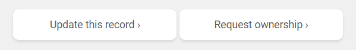
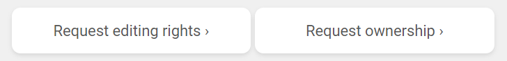
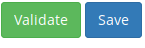

IFB tools
=========

.. warning::
   WORK IN PROGRESS - THESE GUIDELINES ARE CURRENTLY BEING WORKED ON / ARE IN A MESS. PLEASE COME BACK LATER.

These instructions will guide you through the steps to register your tools and databases in `bio.tools`_ and describe them to the standard required for inclusion in the next iteration of the `IFB Catalogue <https://www.france-bioinformatique.fr/en/ressources>`_ - the French national catalogue of bioinformatics resources.

There are various sources of information amd help:

* This document provides guidelines tailored to the IFB catalogue, highlighting key information and common pitfalls.
* The *bio.tools* `Curators Guide <https://biotools.readthedocs.io/en/latest/curators_guide.html>`_ provides in-depth curation guidelines. It's referred to a lot from here!
* The `biotoolsSchema documentation <https://biotoolsschema.readthedocs.io/en/latest/>`_ summarises the tool attributes, their structure, and the controlled vocabularies used by *bio.tools*, including the `EDAM ontology <https://edamontologydocs.readthedocs.io/en/latest/>`_.

* Mail `Jon Ison <mailto:jon.c.ison@gmail.com>`_ (for IFB-specific queries) or `registry-support <mailto:registry-support@elixir-dk.org>`_ (general *bio.tools* queries) to get help.

.. note::
    These instructions are tailored to the needs of IFB tool providers.  If you find a bug, or have any questions or suggestions, please mail `Jon Ison <mailto:jon.c.ison@gmail.com>`_.  For general queries about *bio.tools* mail `registry-support <mailto:registry-support@elixir-dk.org>`_.

    
1. Get a bio.tools account
--------------------------

You'll need an account to create *bio.tools* entries or edit existing ones.  Creating an account is simple: just go to `bio.tools`_ and click on |Sign-up| at the top-right corner of the page.

.. |Sign-up| image:: _static/sign_up.png
   :width: 100px
   :height: 30px

You'll be asked for a username, email address and password.  Your account will be setup immediately.

2. Claim your bio.tools entries
-------------------------------
As a software developer or service provider, you should own the *bio.tools* entries describing your tools, by claiming ownership of existing entries or creating new ones.    

To see whether a tool is already registered, search for it by its name. You may need to click on the "Name" facet to narrow-down the search:

.. image:: _static/find_tool.png

If you find an entry you can go ahead and update_ it.  If you can't find the entry, you'll need to create_ it. In any case, before editing your entries, please ensure you understand the  `information requirement <https://biotools.readthedocs.io/en/latest/IFB_tools.html#understand-the-information-requirement>`_ and follow the instructions_ below.

.. note::
   *bio.tools* entries are owned by the individuals who created them. Owners may grant edit rights, or transfer ownership of their entries to other registered users. The rightful owner of a *bio.tools* entry is usually the person who developed the tool, or provides an online service, but it can be some other responsible person, *e.g.* a dedicated curator.

.. important::
   All tools that were submitted for consideration in the ELIXIR FR Service Delivery Plan should already be registered, but may have only very basic details. You will need to take ownerhsip and improve the entries.
   
Existing entries
""""""""""""""""
.. _update:

To edit an existing entry, you need to bring up the Tool Card for the tool in question, *e.g.* https://bio.tools/signalp.  You'll see up to three different buttons at the bottom right of the Tool Card:

 

* Click on *Request ownership* if you want to claim ownership of the entry
* Click on *Request editing rights* if you want to get edit rights to the entry, but not own it 
* Click on *Update this record* (visible only if you own the entry or have editing rights) to edit the entry.

.. note::
   It can take a little while for other users to respond to requests for edit rights or ownership.  If these are not granted within a day or two, please `mail registry-support <mailto:registry-support@elixir-dk.org>`_.

  
New entries
"""""""""""
.. _create:	    

To create new entries you'll need to be logged onto *bio.tools*. Click on *Menu ... Add content*

.. image:: _static/add.png

bio.tools registration interface
""""""""""""""""""""""""""""""""
* The *bio.tools* registration interface helps you to create and edit valid tool descriptions.  It provides some hints, and ensures that the information you set is in the right format.

Tool descriptions are edited using the *bio.tools* registration interface, which is organised into different tabs ("Summary", "Function", "Labels" *etc.*).

At any moment, you can click on Save |validate_save| to save your edits, and immediately publish the changes online.  All the information you specified will be checked to ensure it's in the right syntax. You can, optionally, force a manual syntax check by clicking on Validate. 

.. image:: _static/registration_interface.png

    
.. _`add content`: https://bio.tools/register

.. |asterix| image:: _static/red_asterix.png
   :width: 15px
   :height: 20px

   
.. Important::
   The attributes required by *bio.tools* (tool name, description and homepage URL) are marked with a red asterix |asterix| in the registration interface, and must be given before a new entry can be created.  Much more information is required for the IFB catalogue, but this is not enforced by *bio.tools* ! 

.. note::
   It's possibe to create tool descriptions in JSON format directly in a text editor, and either paste these into the registration interface ("JSON" tab) or use the *bio.tools* API.  For guidance on using the API, see the `API Reference <https://biotools.readthedocs.io/en/latest/api_reference.html>`_ and the `API Usage Guide <https://biotools.readthedocs.io/en/latest/api_usage_guide.html>`_. 

    

	   

3. Understand the information requirement
-----------------------------------------

bio.tools
#########
*bio.tools* requires only the tool name, description and homepage URL for a tool to be registered, whilst supporting 50 attributes for rich tool descriptions.  The attributes, and their structure and syntax (enforced by *bio.tools*) are defined in `biotoolsSchema <https://biotoolsschema.readthedocs.io/en/latest/>`_.

The IFB catalogue
#################

The information requirement of the IFB catalogue is more stringent than *bio.tools*, and depends upon the type of tool (command-line tool, database *etc.*) that is being registered.  In the guidelines below, tool attribute are described as *Mandatory*, *Recommended* or *Optional* for a given type of tool: 

* **Mandatory** attributes **MUST** be specified.
* **Recommended** attributes **SHOULD** be specified, but are not strictly required.
* **Optional** attributes **CAN** be specified, to produce a rich tool description.

.. image:: _static/ifb_info_standard.png

.. note::
   The above diagram is intended to give a quick overview of the information requirement.  Only the main types of tool and most important attributes are shown.  The instructions_ below cover everything in a step-by-step way.

			       
.. _instructions:
4. Describe your tools
----------------------

Summary
"""""""
For this first part, you specify the tool **name**, a short **description** and its **homepage URL**.

.. csv-table::
   :header: "Attribute", "Requirement", "Guidelines"
   :widths: 25, 100
      
   "Name", "Mandatory", <link https://biotools.readthedocs.io/en/latest/curators_guide.html#name-tool>_
   "Description", "Mandatory", <link https://biotools.readthedocs.io/en/latest/curators_guide.html#description>_
   "Homepage URL", "Mandatory", <link, https://biotools.readthedocs.io/en/latest/curators_guide.html#homepage>_
   "Software version(s)", "Ignore", <link, https://biotools.readthedocs.io/en/latest/curators_guide.html#version-tool>_

.. Important::
   A `unique identifier <https://biotools.readthedocs.io/en/latest/curators_guide.html#id105>`_ for a tool (the *bio.tools* toolID) is set when a new entry is created.  The ID provides a persistent reference to the tool, used by bio.tools and other systems. It's important therefore that the ID is sensible and intuitive.

   The ID is a URL-safe version of the supplied tool name. It is **not** currently editable, so if you want the ID to differ from the name (*e.g.* a name "Protein databank (PDB)" and an ID simply of "PDB), you have to apply a workaround: 1) create the entry giving a value for "Name" which is the desired ID value.  2) Save the entry.  3) Edit the entry, resetting the name.

   To request an ID change post-registration you have to mail `Registry Support <mailto:registry-support@elixir-dk.org>`_. 

      
Function
""""""""
This is where you describe the functionality of the tool based on the `EDAM ontology`_ [1]_.
The functionality is captured in a diagram on the Tool Cards that look like this:

|biotool_function| 

In each box, you can add as many fields as you want. You can also add a general comment about the function (*this is particularly useful when your entry has several functions*).  It's highly recommended to read up about `tool functions <https://biotools.readthedocs.io/en/latest/curators_guide.html#toolfunctions>`_ before filling this section.

.. Note::
   It can be difficult to find the right terms to describe a tools operation(s), input(s) or output(s).  You can use `OLS EDAM`_, `BioPortal`_ and `EDAM Browser`_ to browse EDAM and find the terms you need, or request new terms via `GitHub <https://github.com/edamontology/edamontology/issues>`_.  Improvements (including term requests) to the term picker in *bio.tools* are planned.
    
.. _`EDAM ontology`: http://github.com/edamontology/edamontology/
.. _`OLS EDAM`: https://www.ebi.ac.uk/ols/ontologies/edam
.. _`BioPortal`: https://bioportal.bioontology.org/ontologies/EDAM/?p=classes&conceptid=root
.. _`EDAM Browser`: https://ifb-elixirfr.github.io/edam-browser/

.. |biotool_function| image:: _static/biotool_function.png

Labels
""""""
In this part, you can tell more about your tool:

* What **type** of resource it is (Command-line tool, Web application *etc.*)
* Relevant **topic(s)** the tool fits with (from the `EDAM ontology`_ [1]_).
* In which **operating system** it is possible to use it.
* The **language** used to develop the tool, its **license** and **maturity**.
* The **accessibility** of your tool and its **cost**.

You can also assign your tool to an arbitrary **collection** which can be useful for grouping together related tools.

Links
"""""
It is the place where your add links that do not belong to Download or Documentation.  For instance, a link to a mailing list, mirror or repository (full list available on the drop-down menu of **Link type**).

Download
""""""""
You can here share all the different download links you want. It can be many different kind such as binaries, source code, biological data, test data *etc.* (see the **Download type** drop-down menu).

Documentation
"""""""""""""
Make your different documentations for your tool available here. Again, you can assign type of documentation using **Documentation type**.

Publications
""""""""""""
Share the different publications of the tool, which can be the primary publication (the one to cite when the tool is used), but also
reviews or secondary references (see **Publication type**). You can use either the **PubMed Central ID** (PMCID), the **PubMed ID** (PMID) or the **Digital Object ID** (DOI) - DOI is preferred.

.. _credits:

Credits & Support
"""""""""""""""""
Credits include all type of entities that contributed to the development, maintenance or provision of the resource. Credits can have an **Entity type** (Person, Institute *etc.*) and an **Entity role** (Developer, Documentor *etc.*).  Use the role of *Primary contact* to indicate preferred contact details.

.. _json:

JSON
""""
This is all the information you gave about your tool, formatted in JSON format.

Permissions
"""""""""""
You can decide to make the entry either editable only by yourself, a list of users or anyone.

Remove a resource
-----------------
From the tool card, click on update this record. Then you can remove the entry by clicking on the remove button |remove|.

.. |remove| image:: _static/remove.png
   :width: 55px
   :height: 30px

.. warning::
    Removing an entry is definitive.  There's no way back (other than emailing `Registry Support <mailto:registry-support@elixir-dk.org>`_).

Search for a tool
-----------------
Coming soon...

References
----------
.. [1] Ison, J., Kalaš, M., Jonassen, I., Bolser, D., Uludag, M., McWilliam, H., Malone, J., Lopez, R., Pettifer, S. and Rice, P. (2013). EDAM: an ontology of bioinformatics operations, types of data and identifiers, topics and formats. Bioinformatics, 29(10): 1325-1332.

.. _`bio.tools`: https://bio.tools
