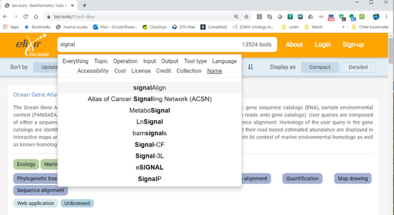
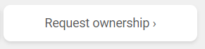
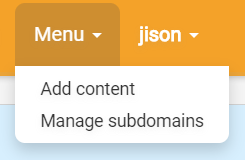
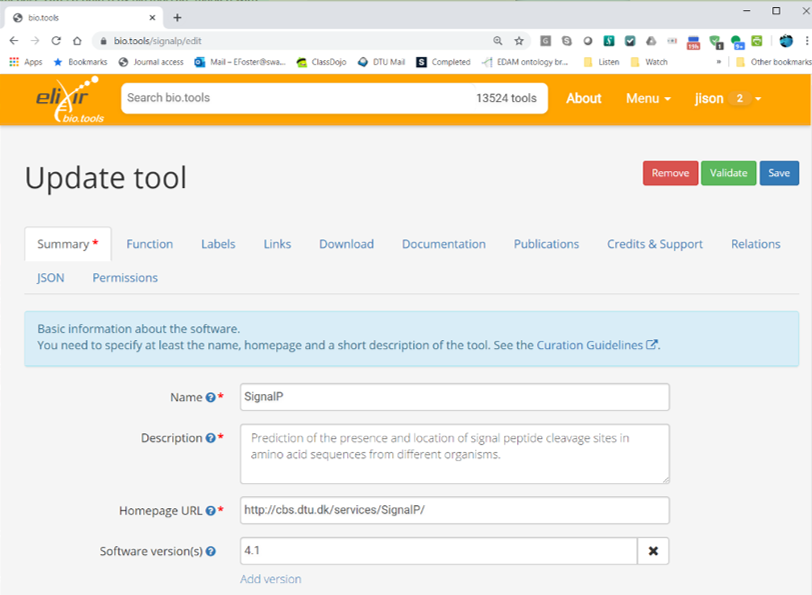
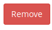
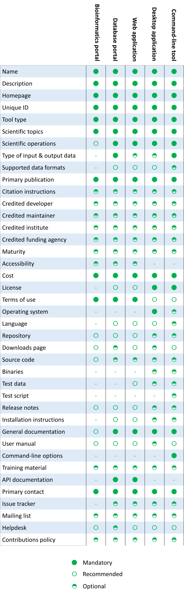
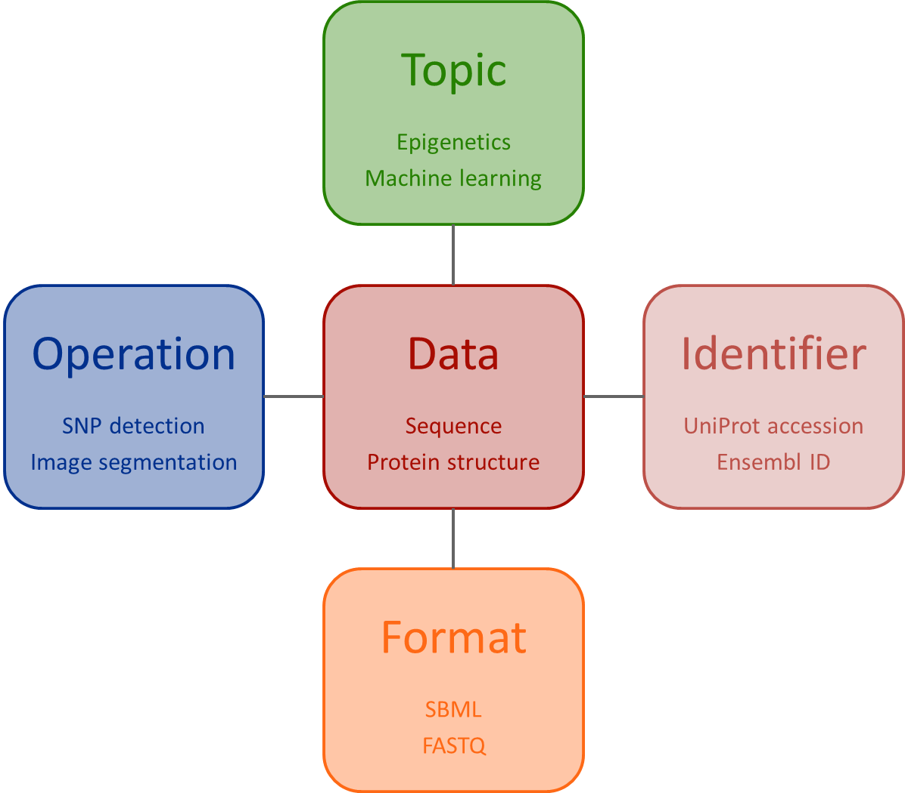
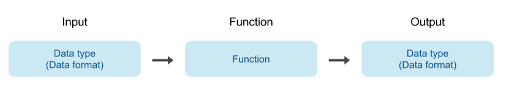
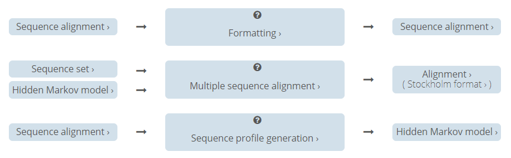

IFB tools
=========

.. warning::
   **WORK IN PROGRESS** - THESE GUIDELINES ARE BEING WORKED ON

   PLEASE COME BACK LATER

These instructions will guide you through the steps to register your tools and databases in `bio.tools <https://bio.tools>`_ and describe them to the standard required for inclusion in the next iteration of the `IFB Catalogue <https://www.france-bioinformatique.fr/en/ressources>`_ - the French national catalogue of bioinformatics resources.

There are various sources of information and help:

* *This document* provides guidelines tailored to the IFB catalogue, highlighting key information and common pitfalls.
* The *bio.tools* `Curators Guide <https://biotools.readthedocs.io/en/latest/curators_guide.html>`_ provides in-depth curation guidelines. You might need to refer to it, wherever you see the {`learn more <https://biotools.readthedocs.io/en/latest/curators_guide.html>`_} links.
* The `biotoolsSchema documentation <https://biotoolsschema.readthedocs.io/en/latest/>`_ summarises the attributes, information model and controlled vocabularies - including the `EDAM ontology <https://edamontologydocs.readthedocs.io/en/latest/>`_ - used for *bio.tools* tool descriptions. Most of the details you need are included here.

* To get help using *bio.tools*, or for general curation advice, please mail `registry-support <mailto:registry-support@elixir-dk.org>`_.
* If you have questions specifically about the IFB catalogue curation process, you can mail `Jon Ison <mailto:jon.c.ison@gmail.com>`_ directly.
  
  
.. note::
    These instructions are tailored to the needs of IFB tool providers.  If you find a bug, or have any questions or suggestions, please post them on `GitHub <https://github.com/bio-tools/biotoolsDocs/issues>`_.  

    
1. Get a bio.tools account
--------------------------
.. _Get_a_bio.tools_account
You'll need an account to create *bio.tools* entries or edit existing ones.  Creating an account is simple: just go to `bio.tools <https://bio.tools>`_ and click on |Sign-up| at the top-right corner of the page.

You'll be asked for a username, email address and password.  Your account will be setup immediately.

.. note::
   *bio.tools* entries are owned by the individuals who created them. Owners may grant edit rights, or transfer ownership of their entries to other registered users. The rightful owner of a *bio.tools* entry is usually the person who developed the tool, or provides an online service, but it can be some other responsible person, *e.g.* a dedicated curator.

2. Claim your bio.tools entries
-------------------------------
As a software developer or service provider, you should own the *bio.tools* entries describing your tools, by claiming ownership of existing entries or creating new ones.    

You'll need to login first, by clicking on |Login| at the top-right corner of the page.

To see whether a tool is already registered, search for it by its name. Simply type the name in the search box. You may need to click on the *Name* facet to narrow-down the search:

Once you find your entry you can go ahead and `update <#updating-entries>`_ it.  If you can't find the entry, you'll need to `create <#creating-entries>`_ it. 

.. important::
   All tools that were submitted for consideration in the ELIXIR FR Service Delivery Plan should already be registered, but may have only very basic details. You will need to take ownerhsip and improve the entries.  Before starting work, please ensure you understand the `information requirement <#understand-the-information-requirement>`_ and follow the `guidelines <#describe-your-tools>`_  below.

Updating entries
""""""""""""""""
To edit an existing entry, you need to click through to the Tool Card for the tool in question, *e.g.* https://bio.tools/signalp.  You'll see a one or two buttons at the bottom right of the Tool Card, depending on whether you're logged in, and own the entry or not. 

 
.. image:: _static/request_edit_rights.png
   :width: 200px
   :height: 45px

* Click on *Request ownership* if you want to claim ownership of the entry
* Click on *Request editing rights* if you want to edit rights on the entry, but not own it 
* Click on *Update this record* to edit the entry (visible only if you own the entry or have editing rights) 

.. note::
   It can take a little while for other users to respond to requests for edit rights or ownership.  If these are not granted within a day or two, please mail `registry-support <mailto:registry-support@elixir-dk.org>`_.

Creating entries
""""""""""""""""
To create new entries you'll need to be logged onto *bio.tools*. Click on *Menu ... Add content*:

bio.tools registration interface
""""""""""""""""""""""""""""""""
The *bio.tools* registration interface helps you to create valid tool descriptions. It's organised into different tabs (*Summary*, *Function*, *Labels* *etc.*):

The registration interface provides some hints, and ensures that the information you set is in the right format. At any moment, you can click on |save| to save your edits, and immediately publish the changes online.  All the information you specified will be checked to ensure it's in the right syntax. To (optionally) force a manual syntax check, click on |validate|.
	   

.. |asterix| image:: _static/red_asterix.png
   :width: 15px
   :height: 20px

   
.. Important::
   The attributes required by *bio.tools* (tool name, description and homepage URL) are marked with a red asterix |asterix| in the registration interface, and must be given before an entry can be saved.  Much more information is required for the IFB catalogue, but this is not enforced by *bio.tools* !  

.. note::
   It's possibe to create tool descriptions in JSON format directly in a text editor, and either paste these into the registration interface ("JSON" tab) or use the *bio.tools* API.  For guidance on using the API, see the `API Reference <https://biotools.readthedocs.io/en/latest/api_reference.html>`_ and the `API Usage Guide <https://biotools.readthedocs.io/en/latest/api_usage_guide.html>`_. 

Removing entries
""""""""""""""""
To remove an entry, from the Tool Card, click on *Update this record*. Then you can remove the entry by clicking on |remove|.

.. warning::
    It shouldn't normally be necessary to remove a *bio.tools* entry, and you should try to avoid needing to do so!  Although deleted entries are actually just hidden, not really deleted, removing an entry is definitive.  There's no way back (other than emailing `Registry Support <mailto:registry-support@elixir-dk.org>`_).

3. Understand the information requirement
-----------------------------------------

bio.tools
"""""""""
*bio.tools* requires only the name, description and homepage URL for a tool registration, but supports a comprehensive set of attributes for rich tool descriptions.

.. note::
   The attributes supported by *bio.tools*, their structure and their syntax are defined in formalised XML schema called `biotoolsSchema <https://biotoolsschema.readthedocs.io/en/latest/>`_.  You don't need to look at the schema, because everything is handled through *bio.tools*. If you'd like to learn more or contribute to this project, please head over to `GitHub <https://github.com/bio-tools/biotoolsSchema>`_.

The IFB catalogue
"""""""""""""""""

The information requirement of the IFB catalogue is more demanding than *bio.tools*, and depends upon the type of tool (command-line tool, database *etc.*) that is being registered.  In the guidelines, tool attribute are described as *Mandatory*, *Recommended* or *Optional* for a given type of tool: 

* **Mandatory** attributes **MUST** be specified.
* **Recommended** attributes **SHOULD** be specified, but are not strictly required.
* **Optional** attributes **CAN** be specified, to produce a rich tool description.

The above diagram is intended to give a quick overview of the information requirement.  Only the main types of tool and most important attributes are shown.  The `guidelines <#describe-your-tools>`_ below cover exactly what's needed for each type of tool, and go through the curation process in a step-by-step way.
  
.. important::	   
   All tools in the IFB catalogue **must** have at least a minimal description, *i.e.* all *mandatory* attributes are specified. Tool providers are encouraged to provide an enhanced description which also includes all of the *recommended* attributes.
   

4. Plan your curation work
--------------------------   

bio.tools enries
""""""""""""""""

.. important::
   Before you use *bio.tools* to create and edit tool descriptions, it's important to plan carefully the entries with respect to the types of tool and the functions they perform. Be sure to understand:
   
   1. The type of tool being described - this determines the information requirement - and is covered in the section below on `tool type`_. 
   2. The tool functionality and how it should be described  - covered in the section on `tool functions <#function>`_.
   3. Whether one or more entries are needed (see below).

Plan what new entries (if any) are required to describe your tools:

* A discrete tool - one which is clearly an individual, distinct entity - should have it's own entry. This is the case for most *command-line tools* and *desktop applications*.
* *bio.tools* aims to catalogue *unique* tool functionality. Different implementations but with esesentially the same functionality can be described by a single entry, *e.g.* a command-line tool that is later adapted into an R package for the Bioconductor suite, or which is served online via a Galaxy server.
* In some cases, *e.g.* complex software packages, it's not obvious whether to have one or multiple entries. Pick the option which mostly clearly illustrates the tool's functionality to end-users.
* Tool collections should be described by multiple entries. For example, one entry to describe a *suite*, and multple other entries to describe the individual tools within that suite. 
* Software with multiple interfaces should be described by a single entry, assuming these interfaces have essentially the same functionality. For example, a *command-line tool* whose functionality is also available via a *web application*, or a *database portal* with a *web API*.
* Many *database portals* provide the typical database functions (browse, deposit, search, visualise, analyse and download), often in different interface components.  Usually one entry will suffice, but sometimes multiple entries are better, especially where the portal provides multiple analytical functions under different interfaces.
* For very complex entities such as *Bioinformatics portals*, do not try to describe everything in a single entry.  Use a single entry for the portal, and multiple other entries for the things aggregated by the portal.
 

Familiarise yourself with EDAM
""""""""""""""""""""""""""""""
.. _Familiarise_yourself_with_EDAM:
The `EDAM ontology <https://github.com/edamontology/edamontology>`_ provides *bio.tools* with a controlled vocabulary to describe the scientific function of a tool, including the general scientific domain, specific operations it performs, types of input and output data, and supported data formats.

	   
.. image:: _static/EDAMrelations.png
   :width:  500px
   :height: 500px
   :align: center
	   
The EDAM ontology includes four main types of concept (or subontologies), shown in boxes above. The concepts are *Topic*, *Operation*, *Data* and *Format*, with *Identifier* being a specialisation of *Data*. Relationships between EDAM concepts are defined internally within the ontology. You don't need to worry about these details, as it's all handled by *bio.tools*.

Three EDAM browsers, each with different functionality, can be used to find EDAM terms:

.. _`OLS`: https://www.ebi.ac.uk/ols/ontologies/edam
.. _`BioPortal`: https://bioportal.bioontology.org/ontologies/EDAM/?p=classes&conceptid=root
.. _`EDAM Browser`: https://ifb-elixirfr.github.io/edam-browser/

* `OLS`_
* `BioPortal`_
* `EDAM Browser`_

.. tip::
   The EDAM term picker currently implemented in *bio.tools* is not very powerful.  It's strongly recommended to use the browsers above.  If you can't find exactly the terms you need, multiple searches using synonyms, alternative spellings *etc.* can help.

   A much better term picker is on the way, and while not yet fully integrated into *bio.tools* is already very useful:

   * `EDAM Tool Annotator <https://bio.tools/static/eta/>`_

   You can use this to pick relevant topics and define the function of your tools.  The ouput (in the bottom pane of the window) is a JSON object that can be copy-pasted into the *JSON* tab of the *bio.tools* `registration interface <#bio-tools-registration-interface>`_, when editing a tool description.

   If you can't find the right term, please request it to be added to EDAM via `GitHub <https://github.com/edamontology/edamontology/issues/new>`_ but first read the guidelines on `how to request a term <https://edamontologydocs.readthedocs.io/en/latest/getting_involved.html#suggestions-requests>`_.  It takes some time for new terms to be supported in *bio.tools*, so if you need many new terms, please plan ahead and contact the `EDAM developers <mailto:edam@elixir-dk.org>`_ if you need help.

5. Describe your tools
----------------------

The sections below match the tabs in the *bio.tools* registration interface.  

.. tip::
   The {`learn more <https://biotools.readthedocs.io/en/latest/curators_guide.html>`_} links take you to more detailed guidelines in the *bio.tools* Curators Guide. Follow these links whenever you're not sure about what information is needed.

   
Summary
"""""""
In the *Summary* tab you specify basic information about the software:

.. csv-table::
   :header: "Attribute", "Requirement"
   :widths: 25, 100
      
   **Name**,            **Mandatory**
   **Description**,     **Mandatory**
   **Homepage URL**,    **Mandatory**
   Software version(s), *ignore*

* **Name** is the short-form name by which the tool is commonly known, *e.g.* "BLAST" **not** "Basic Local Alignment Search Tool".  Database names should follow a pattern where the name and abbreviation are given *e.g.* "The Protein Databank (PDB)" {`learn more <https://biotools.readthedocs.io/en/latest/curators_guide.html#name-tool>`_}.
* **Description** is a *concise* textual summary of the *tool function or purpose*.  It can usually be copy-pasted from the tool homepage.  Do not include statements about performance, provenance, governance *etc.* {`learn more <https://biotools.readthedocs.io/en/latest/curators_guide.html#description>`_}.
* **Homepage URL** is the tool's homepage, or some URL that best serves this purpose {`learn more <https://biotools.readthedocs.io/en/latest/curators_guide.html#homepage>`_}.
   
.. Important::
   A `unique identifier <https://biotools.readthedocs.io/en/latest/curators_guide.html#id105>`_ - the *bio.tools* **toolID** - is created for a tool when a new entry is created. The ID value is a URL-safe version of the supplied tool name. The ID provides a persistent reference to the tool, used by bio.tools and other systems.

   The ID should be sensible and intuitive.  For databases, or tools with long names, the abbreviation should be used. For example, the `GnpIS tool <https://bio.tools/gnpis>`_ tool has the ID "gnpis" and *not* "Genetic and Genomic Information System". 

.. Tip::   
   The toolID is **not** currently editable, so if you want the ID to differ from the name (*e.g.* an ID of "PDB" for the tool name "Protein databank (PDB)", you have to apply a workaround:
   
   1) create the entry giving a value for "Name" which is the desired ID value, *e.g.* "PDB"
   2) Save the entry
   3) Edit the entry, resetting the name, *e.g.* to "Protein Databank (PDB)"

   To request an ID change post-registration (to be avoided!) you have to mail `Registry Support <mailto:registry-support@elixir-dk.org>`_.

Labels
""""""
In the *Labels* tab you specify miscellaneous scientific, technical and administrative details, expressed in terms from controlled vocabularies:

.. csv-table::
   :header: "ATTRIBUTE", "REQUIREMENT"
   :widths: 25, 100
	    
   **Tool type**,        **Mandatory**
   **Topic**,            **Mandatory**
   **License**,          **Mandatory** (Desktop application)
              ,          **Recommended** (Command-line tool)
   **Accessibility**,    "**Mandatory** (Bioinformatics portal, Database portal, Web application)"
   **Operating system**, **Mandatory** (Desktop application)
                       , **Recommended** (Command-line tool)
   **Cost**,             "**Recommended** (Desktop application, Command-line tool)"
   **Language**,         **Recommended** (Command-line tool)
   **Maturity**,         **Recommended**
   **Collection**,       **Optional**
   ELIXIRPlatform,       *ignore*
   ELIXIRNode,           *ignore*
   Other ID,             *ignore*

* **Tool type** describes the type of the tool: a *bio.tools* entry can have more than one type. See `below <tool-type>`_  {`learn more <http://biotools.readthedocs.io/en/latest/curators_guide.html#tool-type>`_}.
* **Topic** is the general scientific domain the tool serves, or other general category (an EDAM term). See `below <topic>`_ {`learn more <https://biotools.readthedocs.io/en/latest/curators_guide.html#topic>`_}.
* **Operating system** is the operating system supported by a downloadable software package - pick all that apply {`learn more <http://biotools.readthedocs.io/en/latest/curators_guide.html#operating-system>`_}.
* **Language** is the name of a programming language the tool source code was written in {`learn more <http://biotools.readthedocs.io/en/latest/curators_guide.html#programming-language/>`_}.
* **License** is a software or data usage license. See `below <license>`_ {`learn more <http://biotoolsschema.readthedocs.io/en/latest/controlled_vocabularies.html#license>`_}.
* **Maturity** is how mature the software product is; *Emerging*, *Mature* or *Legacy*. Don't pick *Mature* for tools which aren't really mature yet! {`learn more <http://biotoolsschema.readthedocs.io/en/latest/controlled_vocabularies.html#maturity>`_}.
* **Cost** is the monetary cost of acquiring the software {`learn more <http://biotoolsschema.readthedocs.io/en/latest/controlled_vocabularies.html#cost>`_}.
* **Accessibility** is whether the software is freely available for use; *Open access*, *Restricted access*, *Proprietary* or *Freeware*. Check the definitions carefully before picking these terms! {`learn more <http://biotools.readthedocs.io/en/latest/curators_guide.html#accessibility>`_}.

   
.. tip:: 
   You can use **Collection** to assign tools which are somehow related to one or more groups. These collections can have any names you like. Other ways to group tools are by creating a *bio.tools* subdomain (from *Menu...Manage subdomains*) and by defining `relations <https://biotools.readthedocs.io/en/latest/curators_guide.html#relation-group>`_ between tools.

.. note::
  **ELIXIRNode** and **ELIXIRPlatform** define the name of an ELIXIR node or ELIXIR platform, respectively, that is credited for the tool. All tools in the IFB catalogue will have the ELIXIRNode credit set to "France".  These are not normally be set by *bio.tools* users {`learn more <http://biotools.readthedocs.io/en/latest/curators_guide.html#elixir-node>`_}.
  

Tool type
^^^^^^^^^
The scope of *bio.tools* is very broad, ranging from simple scripts to comprehensive bioinformatics portals, defined by 15 different `tool types <https://biotoolsschema.readthedocs.io/en/latest/controlled_vocabularies.html#tool-type>`_.  The vast majority of entries are of the following types:

.. csv-table::
   :header: "TYPE", "DESCRIPTION"
   :widths: 25, 100

   **Bioinformatics portal**, "A web site providing a platform/portal to multiple resources used for research in a focused area, including biological databases, web applications, training resources and so on."
   **Database portal**,       "A Web site providing a portal to a biological database, typically allowing a user to browse, deposit, search, visualise, analyse or download data."
   **Web application**,       "A tool with a graphical user interface that runs in your Web browser."
   **Desktop application**,   "A tool with a graphical user interface that runs on your desktop environment, *e.g.* on a PC or mobile device."
   **Command-line tool**,     "A tool with a text-based (command-line) interface."

Other common types incude:

.. csv-table::
   :header: "TYPE", "DESCRIPTION"
   :widths: 25, 100
	    
   **Web API**,   "An application programming interface (API) consisting of endpoints to a request-response message system accessible via HTTP.  Includes everything from simple data-access URLs to RESTful APIs."
   **Workflow**,  "A set of tools which have been composed together into a pipeline of some sort.  Such tools are (typically) standalone, but are composed for convenience, for instance for batch execution via some workflow engine or script."
   **Suite**,    "A collection of tools which are bundled together into a convenient toolkit.  Such tools typically share related functionality, a common user interface and can exchange data conveniently.  This includes collections of stand-alone command-line tools, or Web applications within a common portal."
   **Workbench**, "An application or suite with a graphical user interface, providing an integrated environment for data analysis which includes or may be extended with any number of functions or tools.  Includes workflow systems, platforms, frameworks etc."
   **Workflow**, "A set of tools which have been composed together into a pipeline of some sort.  Such tools are (typically) standalone, but are composed for convenience, for instance for batch execution via some workflow engine or script."
   **Library**,   "A collection of components that are used to construct other tools.  bio.tools scope includes component libraries performing high-level bioinformatics functions but excludes lower-level programming libraries."

A single *bio.tools* entry is annotated with one or more types, reflecting different facets of the tool described by the entry. Be sure to understand the type(s) of tool you have, because it determines the information that's expected.  A few suggestions:

* *Bioinformatics portals* provide an unmbrella to other tools and databases, but don't (typically) directly serve them. Only use *Bioinformatics portal* for sites that cover multiple other resources, each which have their own distinct entity (and should have their own *bio.tools* entries).  Good examples include `IMGT <http://www.imgt.org/>`_ and `wheatIS <http://www.wheatis.org/index.php>`_.  
* *Suite* might be more applicable than *Bioinformatics portal*.  Example include Web application suites such as `CRISRP-Cas++ <https://crisprcas.i2bc.paris-saclay.fr/>`_ and `EvryRNA <https://evryrna.ibisc.univ-evry.fr/evryrna/evryrna/evryrna_home>`_, and suites of command-line tools such as `BioConductor <http://www.bioconductor.org/>`_.
*  *Workbench* might be also be more applicable than *Bioinformatics portal*.  This includes online and desktop integrated environements. Example include the general-purpose `Galaxy <https://usegalaxy.org/>`_ workbench and domain-specific ones such as `MetExplore <http://www.metexplore.fr/>`_ and `MicroScope <https://www.genoscope.cns.fr/agc/microscope/home/index.php>`_.
* Typically use only one of *Bioinformatics portal*, *Database portal* or *Web application* in a single entry.  If the resource is providing a database, then just go with *Database portal*, a good example being `Norine <https://bioinfo.lifl.fr/norine/>`_.
* In general, often a singe tool type will do. For example, `LoRDEC <http://atgc.lirmm.fr/lordec/>`_ (a *Command-line tool*), `GINsim <http://ginsim.org/>`_ (a *Desktop application*), and `Ocean Gene Atlas <http://tara-oceans.mio.osupytheas.fr/ocean-gene-atlas/>`_ or `Genomicus <http://www.genomicus.biologie.ens.fr/genomicus-97.01/cgi-bin/search.pl>`_ (both are *Web application*).  
* But do pick all the types that apply.  For example the `BOOSTER <https://booster.pasteur.fr/>`_ *Command-line tool* is also available as a *Web application* (and if these implementations have essentially the same functionality, they'd be described in a single *bio.tools* entry).
* If a database has an API (most do!) then use both *Database portal* and *Web API*, for example `aNISEED <https://www.aniseed.cnrs.fr/>`_.
* Use the more specialised tool types where they are applicable, for example *Workflow* for `Workflow4Metabolomics <https://workflow4metabolomics.org/>`_ and *Library* for any R pacages.

.. tip::
   Software is complex and it can be tricky to assign a type.  Make sure you understand the `tool type definitions <https://biotoolsschema.readthedocs.io/en/latest/controlled_vocabularies.html#tool-type>`_ before you use them. For example, in *bio.tools* a *Web service* is specifically a SOAP+WSDL implementation. Most likely you need *Web API* (which covers most APIs nowadays) or just *Web application* (for a tool delivered via the Web but without an API).  
  

   
License
^^^^^^^
All downloadable software should be licensed.  If you can't find your license in the list:

* use *Proprietary* in cases where the software is under some license whereby it can be obtained from the provider (e.g. for money), and then owned, i.e. definitely not an open-source or free software license!
* use *Other* if the software is available under a license not listed by biotoolsSchema and which is not *Proprietary* - please `request <https://github.com/bio-tools/biotoolsschema/issues>`_ the license is added.
* use *Unlicensed* for software which is not licensed and is not *Proprietary* (this is bad - license your software!)

.. note::
   There are many good reasons why you should license your software, ideally picking a FOSS (Free and Open Source Software) license.  Read `A Quick Guide to Software Licensing for the Scientist-Programmer <https://journals.plos.org/ploscompbiol/article?id=10.1371/journal.pcbi.1002598>`_.  Some types of tools *e.g.* *Web application" are not licensed, but instead, should have a `Terms of use <#terms-of-use>`_ document. 

Topic
^^^^^
**Topic** is the place to tag your tool with EDAM terms describing the scientific domain the tool serves, or other general category.  

* specify the most important and relevant scientific topic; up to 3 topics will usually suffice
* don't exhaustively specify all the topics of lower or secondary relevance
* don't rely on the *bio.tools* term picker - use the `EDAM browsers <#Familiarise-yourself-with-EDAM>`_ as needed!

   
 
Function
""""""""
In the *bio.tools* software model, a tool has one or more basic functions, or modes of operation.  Each function performs at least one specific operation, and has one or more primary inputs and outputs, each of a defined type of data and listing supported format(s).

This is shown in a diagram on the Tool Cards that look like this:

|biotool_function|

For example, the tool `signalp <https://bio.tools/signalp>`_ has a single function performing two operations, with a single input and two outputs:

.. image:: _static/signalp_function.png

Whereas the tool `HMMER3 <https://bio.tools/hmmer3>`_ has multiple functions (only 3 shown here):

.. note:: The `HMMER3 <https://bio.tools/hmmer3>`_ entry has very nicely annotated functionality, but is a good example of where the entry would be easier to understand if the functionality was described in separate entries - retaining the existing entry for the suite, but creating a new entry for each of the HMMER programs (alimask, hmmalign, hmmbuid *etc.*).

In the *Function* tab you specify the functions of the tool, expressed in concepts from the EDAM ontology.

.. csv-table::
   :header: "ATTRIBUTE", "REQUIREMENT"
   :widths: 25, 100

   **Operation**,      "**Mandatory** (Web application, Desktop application, Command-line tool)"
                 ,     "**Recommended** (Database portal)"
   **Input->data**,    "**Mandatory** (Web application, Desktop application, Command-line tool)"
                  ,    "**Optional** (Database portal)"
   **Input->format**,  "**Recommended** (Command-line tool)"
                    ,  "**Optional** (Database portal, Web application, Desktop application)"
   **Output->data**,   "**Mandatory** (Database portal, Web application, Desktop application, Command-line tool)"
   **Output->format**, "**Recommended** (Command-line tool)"
                     , "**Optional** (Database portal, Web application, Desktop application)"
   **Note**,           **Optional**
   **Command**,        *ignore*

* **Operation** describes the basic operation(s) performed by this software function {`learn more <https://biotools.readthedocs.io/en/latest/curators_guide.html#operation>`_}.
* **Data** is a type of primary input or output data {`learn more <https://biotools.readthedocs.io/en/latest/curators_guide.html#data-type-input-and-output-data>`_}.
* **Format** is the allowed format(s) of the input or output data {`learn more <https://biotools.readthedocs.io/en/latest/curators_guide.html#data-format-input-and-output-data>`_}.

.. note::  
   You can use **Note** to add a concise comment about this function, if this is not apparent from the software description and EDAM annotations.

.. tip::
   When deciding how to describe your tools, in terms of *bio.tools* entries, their functions and operations, always keep the end-user in mind and try to describe your tools in a way that will be clear to them. It can be difficult to find the right terms to describe a tools operation(s), input(s) or output(s).  It's highly recommended to use `OLS`_, `BioPortal`_ or `EDAM Browser`_ alongside *bio.tools* when describing your tools.  If you're not sure, mail `registry-support <mailto:registry-support@elixir-dk.org>`_ for help.  

   
Operation
^^^^^^^^^
Before describing your tools, you should carefully identify the distinct functions and the individual operations associated with each one. This is often straighforward, as different functions (modes) typically perform distinct operations:

* if a tool has an option between doing one thing or another, then you should annotate the operations as distinct functions
* if in contrast a tool always does one or more things, then you should annotate these as distinct operations within a single function
* only specify the primary functions and operations, from a typical end-user perspective - tools often do many things to its central, advertised purpose - you don't need to describe everything!

.. tip::
   *Database portal* usually provide one ore more of a common set of operations:

   * **Browse**  - *no term in EDAM yet*
   * **Deposit** - *Deposition* (http://edamontology.org/operation_3431)
   * **Search** - *Database search* (http://edamontology.org/operation_2421)
   * **Visualise** - *Visualisation* (http://edamontology.org/operation_0337)
   * **Analyse** - *Analysis* (http://edamontology.org/operation_2945)
   * **Download** - *Data retrieval* (http://edamontology.org/operation_2422)
  
   When annotating the operations, you should specify all of these that apply.  Consider carefully whether the *Analyis* operation(s) would be better listed as functions of discrete tools described in their own own entries (see `bio.tools entries <#bio-tools-entries>`_.

  
Data
^^^^
* data terms must be correctly associated with the operation(s) (for each function, in case the tool has multiple modes of operation)
* only specify the primary inputs and outputs, *e.g.* a sequence alignment tool would be annotated as reading sequences (input), and writing a sequence alignment (output), but not with gap insertion and extension penalties, or other parameters.

.. tip::
   For *Database portal* the data annotations correspond to the common operations:
   
   * For *Deposition* and *Data retrieval* operations, you can associate the types of `data <#data>`_ available for upload (input) or download (output).
   * For *Search* operation, you can specify *Database search results* (http://edamontology.org/data_2080) as an output, or some other more specific term in the `EDAM Data <http://edamontology.org/data_0006>`_ subontology.

Format
^^^^^^
* format terms must be correctly associated with the data type of an input or output
* specify the most widely used of the supported data formats (it can be impractical / onerous to be exhaustive!)

Links
"""""
In the *Links* tab you specify miscellaneous links for the tool.

.. csv-table::
   :header: "ATTRIBUTE", "REQUIREMENT"
   :widths: 25, 100
	    
   **Repository**,           "**Mandatory** (Desktop application, Command-line tool)"
                 ,           "**Optional** (Bioinformatics portal, Database portal, Web application)"
   **Issue tracker**,        "**Mandatory** (Web application, Desktop application, Command-line tool)"
                    ,        "**Recommended** (Database portal)"
   **Mailing list**,         "**Recommended** (Database portal, Web application, Desktop application, Command-line tool)"
                   ,         "**Optional** (Bioinformatics portal)"
   **Helpdesk**,             "**Recommended** (Database portal)"
               ,             "**Optional** (Web application, Desktop application, Command-line tool)"
   **Discussion forum**,     **Optional**
   **Social media**,         **Optional**
   **Other**,                **Optional**
   **Mirror**,               "**Optional** (Bioinformatics portal, Database portal, Web application)"
   **Registry**,             *ignore*
   **Galaxy service**,       *ignore*
   **Service**,              *ignore*
   **Scientific benchmark**, *ignore*
   **Technical monitoring**, *ignore*

   
* **Repository** is where source code, data and other files may be downloaded.
* **Issue tracker** is for software issues, bug reports, feature requests *etc.*
* **Mailing list** is for software announcements, discussions, support *etc.*
* **Helpdesk** is a formal system (*e.g.* ticket system) where users can get support in using the software.

.. note::
   It's strongly recommended to put your source code and other downloadable resources in a public repository such as `GitHub <https://github.com/>`_.  It takes little effort to do so. A repo can serve as a homepage for your tool, and provide an issue tracker and open forum for discussion. If you don't have a repo, you should at least provide a `downloads page <#download>`_.
  

Download
""""""""
In the *Download* tab you specify links to downloads for your software.

.. csv-table::
   :header: "TYPE", "REQUIREMENT"
   :widths: 25, 100

   **Downloads page**,             "**Mandatory** (Database portal)"
                     ,             "**Recommended** (Desktop application, Command-line tool)"
                     ,             "**Optional** (Bioinformatics portal, Web application)"
   **API specification**,          "**Recommended** (Database portal - with API)"
   **Binaries**,                   "**Recommended** (Desktop application, Command-line tool)"
   **Binary package**,             "**Recommended** (Desktop application, Command-line tool)"
   **Container file**,             "**Recommended** (Command-line tool)"
                     ,             "**Optional** (Database portal, Web application, Desktop application)"
   **Source code**,                "**Recommended** (Desktop application, Command-line tool)"
                  ,                "**Optional** (Web application)"
   **Source package**,             "**Recommended** (Desktop application, Command-line tool)"
                     ,             "**Optional** (Web application)"
   **Command-line specification**, "**Optional** (Command-line tool)"
   **VM image**,                   "**Optional** (Database portal, Web application, Desktop application, Command-line tool)"
   **CWL file**,                   **Optional** (Command-line tool)
   **Test data**,                  **Optional** (Command-line tool)
   **Test script**,                **Optional** (Command-line tool)
   **Tool wrapper (galaxy)**,      **Optional** (Command-line tool)
   **Tool wrapper (taverna)**,     **Optional** (Command-line tool)
   **Tool wrapper (other)**,       **Optional** (Command-line tool)
   **Icon**,                       **Optional**
   **Biological data**,            **Optional**
   **Screenshot**,                 **Optional**
   **Other**,                      **Optional**
   **Ontology**,                   *ignore*

* **API specification** is a file providing a machine-readable API specification for the software, e.g. Swagger/OpenAPI, WSDL or RAML file.  It's *not* for human-readable API documentation (see `documentation <#documentation>`_ for that).
* **Binaries** and **Binary package** should trigger a download of the *latest* version available (typically the latest stable version).
* **Command-line specification** is a file providing a machine-readable command line specification for the software. It's *not* for human-readable documentation (see `documentation <#documentation>`_ for that).
* **Container file** including the software.
* **Source code** and **Source package** should trigger a download of the *latest* source code.
* **Downloads page** is a Web page summarising general downloads available for the software.

.. tip::
   With the exception of **Downloads page**, the expectation is that a link annotated in the *Download* section will trigger a download of a file.  If you're adding a link which doesn't have this behaviour, you should see whether an attribute in the `Link <#Links>`_ section is more appropriate.

Documentation
"""""""""""""
In the *Documentation* tab you link to documentation about the software.

.. csv-table::
   :header: "TYPE", "REQUIREMENT"
   :widths: 25, 100
	    
   **General**,                   **Mandatory**
   **Citation instructions**,     **Mandatory**
   **API documentation**,         **Mandatory** (Database portal or Web application - with API)
   **Terms of use**,              "**Mandatory** (Database portal)"
   **Command-line options**,      "**Mandatory** (Command-line tool)"
   **Contributions policy**,      "**Recommended** (Web application, Desktop application, Command-line tool)"
   **Governance**,                "**Recommended** (Bioinformatics portal, Database portal)"
   **Installation instructions**, "**Recommended** (Desktop application, Command-line tool)"
   **Manual**,                    "**Recommended** (Desktop application)"
   **Release notes**,             "**Recommended** (Desktop application, Command-line tool)"
   **FAQ**,                       **Optional**
   **Training material**,         **Optional**
   **Tutorial**,                  **Optional**
   **Other**,                     **Optional**

* **General** is for general documentation. If your tool doesn't have a dedicated documentation page, but is documented elsewhere (*e.g.* on the homepage or a GitHub README.md) then specify that URL instead.
* **Citation instructions** give information on how to correctly cite use of the software.  This is especially important where there are multiple relevant `publications <#publications>`_.
* **API documentation** is human-readable API documentation, and should be specified for many *Database portals* and some *Web applications*.
* **Terms of use** are rules that one must agree to abide by in order to use a service.
* **Command-line options** are human-readable documentation about the command-line interface of a tool.  
* **Contributions policy** is information about policy for making contributions to the software project.
* **Governance** is information about the software governance model.
* **Installation instructions** are instructions how to install the software.
* **Manual** is information on how to use the software, structured into a comprehensive user manual (don't just link here to general documentation).
* **Release notes** are notes about a software release or changes to the software (a change log).  For example a CHANGELOG.md file on GitHub.
	    

.. tip::
   It's very worthwhile to create **contribution guidelines** to communicate how people should contribute to your open source project.  In GitHub this is done by createing a `CONTRIBUTING.MD <https://help.github.com/en/github/building-a-strong-community/setting-guidelines-for-repository-contributors>`_ file.  Lots of good advice, templates and examples are available (*e.g.* `Atom editor <https://github.com/atom/atom/blob/master/CONTRIBUTING.md>`_, `Ruby on Rails <https://github.com/rails/rails/blob/master/CONTRIBUTING.md>`_ and `Open Government <https://github.com/opengovernment/opengovernment/blob/master/CONTRIBUTING.md>`_).

.. tip::
   A well maintained **change log** wlll make it easier for users and contributors to see precisely what notable changes have been made between each release (or version) of the project.  For some great advice, see `keepachangelog.com <a href ="https://keepachangelog.com/en/1.0.0/">`_.

.. note::
   Command-line tools should always have human-readable description of their interface.  If a machine-readable command-line specification (a file) is also available, then you should link to that in the `Download`_ section.

.. important::
   You must not specify a link to a general page where a more specific one is available.  For example, don't link to the homepage in the **General** field if, in fact, there's a dedicated page for documentation. If you want to link to some documentation not of a type listed above then use the **Other** value.

       
Publications
""""""""""""
In the *Publications* tab you specify publications about the software.

.. csv-table::
   :header: "ATTRIBUTE", "REQUIREMENT"
   :widths: 25, 100

   **Primary publication**,  **Mandatory** 

   
Publications are defined as one of the following types:

.. csv-table::
   :header: "TYPE", "DESCRIPTION"
   :widths: 25, 50

   **Primary**, "The principal publication about the tool itself; the article to cite when acknowledging use of the tool."
   **Method**, "A publication describing a scientific method or algorithm implemented by the tool."
   **Usage**, "A publication describing the application of the tool to scientific research, a particular task or dataset."
   **Comparison**, "A publication which assessed the performance of the tool."
   **Review**, "A publication where the tool was reviewed."
   **Other**, "A publication of relevance to the tool but not fitting the other categories."

and can have the following attributes defined:   

.. csv-table::
   :header: "Attribute", "Description"
   :widths: 25, 50

   **pmcid**, "PubMed Central Identifier of a publication about the software."
   **pmid**, "PubMed Identifier."
   **doi**, "Digital Object Identifier."
   **note**, "Comment about the publication."
   **version**, "Version information (typically a version number) of the software applicable to this publication." 

You should specify at least the primary publication for your tool, and ideally any others that are relevant.
   
.. note::
   You should specify **DOI** for publications (if available) and do not have to also specify **pmid** and **pmcid**.  If you do so, then be sure to specify multiple IDs for a single publication within a single publication group.  You can ignore **version**.
  
.. tip::
   It's very important that your tool has some form of publication, if for no other reason than to make it citable.  If you don't have a publication in the scientific press, then you can use `Zenodo <https://zenodo.org/>`_ to create a DOI for this purpose.  Such a DOI should resolve to a page describing the tool. For example http://doi.org/10.5281/zenodo.3519603. 

Credits & Support
"""""""""""""""""
In the *Credits & Support* tab you specify individuals or organisations that should be credited, or may be contacted about the software.  Credits include all type of entities that contributed to the development, maintenance or provision of the resource.   

.. csv-table::
   :header: "ATTRIBUTE", "REQUIREMENT"
   :widths: 25, 100

   **Primary contact**,  **Mandatory**
   **Credited institute**,  **Mandatory**

Creditable entities have one of the following types:

.. csv-table::
   :header: "TYPE", "DESCRIPTION"
   :widths: 25, 100

   **Person**, "Credit of an individual."
   **Project**, "Credit of a community software project not formally associated with any single institute."
   **Division**, "Credit of or a formal part of an institutional organisation, e.g. a department, research group, team, etc"
   **Institute**, "Credit of an organisation such as a university, hospital, research institute, service center, unit etc."
   **Consortium**, "Credit of an association of two or more institutes or other legal entities which have joined forces for some common purpose.  Includes Research Infrastructures (RIs) such as ELIXIR, parts of an RI such as an ELIXIR node etc. "
   **Funding agency**, "Credit of a legal entity providing funding for development of the software or provision of an online service."

and also have a "role":

.. csv-table::
   :header: "ROLE", "DESCRIPTION"
   :widths: 25, 100
	    
   **Developer**, "Author of the original software source code."
   **Maintainer**, "Maintainer of a mature software providing packaging, patching, distribution etc."
   **Provider**, "Institutional provider of an online service."
   **Documentor**, "Author of software documentation including making edits to a bio.tools entry."
   **Contributor**, "Some other role in software production or service delivery including design, deployment, system administration, evaluation, testing, documentation, training, user support etc."
   **Support**, "Provider of support in using the software."
   **Primary contact**, "The primary point of contact for the software."

   
You should specify at least:

* A credit of type **Institute** with one ore more applicable roles.
* A credit of role **Primary contact** with an applicable type.  You can opt to give more than one primary contact, for example specifing one for a project and another for a person.

For any credit, you can specify and of the following:

.. csv-table::
   :header: "Attribute", "Description"
   :widths: 25, 100

   **name**, "Name of the entity that is credited."
   **orcidid**, "Unique identifier (ORCID iD) of a person that is credited."
   **email**, "Email address."
   **url**, "URL, e.g. homepage of an institute."
   **tel**, "Telephone number."
   **typeEntity**, "Type of entity that is credited (see above)"
   **typeRole**, "Role performed by entity that is credited (see above)"
   **note**, "A comment about the credit."
   
.. important::
   A credit can have multipe **role**.  When creating a credit, pick all of the **role** that apply; don't create duplicate credit groupings!

.. note::
   It's strongly recommended that if you (or other people to be credited) don't have an `ORCID iD <https://orcid.org/>`_, that you get one now.  ORCID provides a persistent digital identifier that distinguishes you from every other researcher and, through integration in key research workflows such as manuscript and grant submission, supports automated linkages between you and your professional activities ensuring that your work is recognized.
  

Relations
"""""""""
In the *Relations* tab you can specify details of a relationship this software shares with other software registered in *bio.tools*.

The relationships currently available:

.. csv-table::
   :header: "Relation", "Description"
   :widths: 25, 50

   **isNewVersionOf**, "The software is a new version of an existing software, typically providing new or improved functionality."
   **hasNewVersion**, "(inverse of above)"
   **uses**, "The software provides an interface to or in some other way uses the functions of other software under the hood, e.g. invoking a command-line tool or calling a Web API, Web service or SPARQL endpoint to perform its function."
   **usedBy**, "(inverse of above)"
   **includes**, "A workbench, toolkit or workflow includes some other, independently available, software."
   **includedIn**, "(inverse of above)"

You can ignore this for now, except:

* when annotating a *Suite* (or other collection) specify other tools that the suite **includes**
* when annotating a *Workflow* specify other tools that the workflow **uses**
	    
JSON
""""
In the *JSON* tab you see all the information that you've specified for a tool so far.  You can work directly in this pane if you wish.  This can be very useful when using the `EDAM Tool Annotator <https://bio.tools/static/eta/>`_ to define the tool's function (see the section on `EDAM <Familiarise-yourself-with-EDAM>`_.)

Permissions
"""""""""""
In the *Permissions* tab you can decide to make the entry either editable only by yourself, a list of users or anyone.  See the section on *bio.tools* `accounts <Get-a-bio-tools-account>`_.

