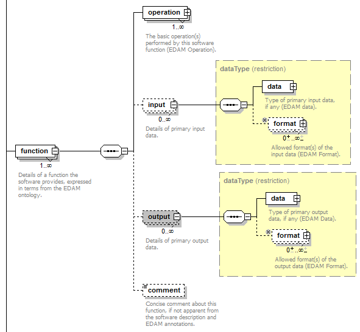

Curators Guide
==============

**UNDER CONSTRUCTION**: guidelines for `bio.tools <https://bio.tools>`_  curators, including EDAM annotation guidelines.  Please provide comments via `GitHub <https://github.com/bio-tools/biotoolsDocs/issues/6>`_

bio.tools includes all types of bioinformatics *tools* - application software with well-defined data processing functions (inputs, outputs and operations).  This ranges from simple tools with a single primary function, to complex, multimodal tools with many disinct functions.  Tools may be available for immediate use as online services, or in a form which a user can download, install, configure and run themselves.

Each bio.tools entry describes a discrete tool.  The scope, *i.e.* the types of tools that may be included, and the attributes for their description, are defined in `biotoolsSchema <https://github.com/bio-tools/biotoolsschema>`_.

Guidelines below include:

- `general guidelines <http://biotools.readthedocs.io/en/latest/curators_guide.html#general-guidelines>`_ including information about `tool functions <http://biotools.readthedocs.io/en/latest/curators_guide.html#id12>`_ and `EDAM annotations <http://biotools.readthedocs.io/en/latest/curators_guide.html#id100>`_.  You should read these first of all.
- guidelines on `specific attributes <http://biotools.readthedocs.io/en/latest/curators_guide.html#summary>`_ defined in the `biotoolsSchema <https://github.com/bio-tools/biotoolsschema>`_ and organised into sections as they appear in the `bio.tools <https://bio.tools>`_ registration user interface
- guidelines specific to individual `types of tools <http://biotools.readthedocs.io/en/latest/curators_guide.html#guidelines-per-tool-type>`_

Individual attribute guidelines are organised as follows:

- **Automatically verified** guidelines are checked as part of automated QC performed periodically by the bio.tools system
- **Manually verified** guidelines are checked as part of manual QC performed by trusted curators (bio.tools admin, entry owners *etc.*)
- Advice given in boxes (notes, tips, caution *etc.* are not verified

The key words "MUST", "MUST NOT", "REQUIRED", "SHALL", "SHALL NOT", "SHOULD", "SHOULD NOT", "RECOMMENDED",  "MAY", and "OPTIONAL" in this document are to be interpreted as described in `RFC 2119 <http://www.ietf.org/rfc/rfc2119.txt>`_ as follows:

- **"MUST"**, **"REQUIRED"** or **"SHALL"** mean that the guideline is an absolute requirement of the specification.
- **"MUST NOT"** or **"SHALL NOT"** mean that the guideline is an absolute prohibition of the specification.
- **"SHOULD"** or **"RECOMMENDED"** mean that there may exist valid reasons in particular circumstances to ignore a particular guideline, but the full implications must be understood and carefully weighed before doing so.
- **"SHOULD NOT"** or the phrase **"NOT RECOMMENDED"** mean that there may exist valid reasons in particular circumstances when acting contrary to the geuideline is acceptable or even useful, but the full implications should be understood and the case carefully weighed before doing so.
- **"MAY** or **"OPTIONAL"** mean that the guideline is truly optional; you can choose to follow it or not.
    
.. note::
   - the guidelines are a key component of an emerging `information standard <http://biotoolsschema.readthedocs.io/en/latest/information_requirement.html>`_ for tools being adopted by bio.tools.  Conformance to this standard (including passing automated and manual QC checks) will, in the future, be labelled within bio.tools.
   - for curation advice or to make suggestions about these guidelines please add comments via `GitHub <https://github.com/bio-tools/biotoolsDocs/issues/6>`_ or mail `registry-support <mailto:registry-support@elixir-dk.org>`_ directly.

     
General guidelines
------------------

Before you start
^^^^^^^^^^^^^^^^
Consider the following *before* creating a bio.tools entry:

1. **Are one or more entries required to describe the software?**

   - `workbenches <http://biotools.readthedocs.io/en/latest/curators_guide.html#workbench>`_ and other `suites <http://biotools.readthedocs.io/en/latest/curators_guide.html#suite>`_ often require multiple entries.
   - tools with multiple interfaces (*e.g.* `Command-line tool <http://biotools.readthedocs.io/en/latest/curators_guide.html#command-line-tool>`_ , `Web API <http://biotools.readthedocs.io/en/latest/curators_guide.html#web-api>`_, `Web service <http://biotools.readthedocs.io/en/latest/curators_guide.html#web-service>`_ and `Web application <http://biotools.readthedocs.io/en/latest/curators_guide.html#web-application>`_) **SHOULD** be described by a single entry **unless** these interfaces provide fundamental functional differences (operations, inputs and outputs).  
     
   If in doubt, mail `registry-support <mailto:registry-support@elixir-dk.org>`_.  

2. **What tool types apply?**

   - one or more `types <http://biotools.readthedocs.io/en/latest/curators_guide.html#tool-type>`_ may be assigned in a single entry reflecting different facets of the software that are described in that entry.
   - read the tool type-specific `guidelines <http://biotools.readthedocs.io/en/latest/curators_guide.html#guidelines-per-tool-type>`_.

     
3. **What if the software is already registered?** 

   - if you're the rightful owner of the entry (*i.e.* the tool developer or provider of an online service) then request ownership of it
   - otherwise, request edit rights 

   Make these requests using the buttons at the bottom of the Tool Card). If you plan to register multiple entries *en masse*, please discuss this first with `bio.tools admin <mailto:registry-support@elixir-dk.org>`_.  
     
4. **Are there version-specific considerations?**

   - as a rule, a bio.tools entry describes the *latest version* available at the time of registration and is updated, as required, for subsequent releases.
   - in exceptional circumstances, a new version with fundamental functional differences (operations, inputs and outputs) and can be registered as an entirely new entry.  In such cases, follow carefully the guidelines for tool `name <http://biotools.readthedocs.io/en/latest/curators_guide.html#name>`_ and `version <http://biotools.readthedocs.io/en/latest/curators_guide.html#version>`_ annotations.

5. **Plan how to describe the tool functions in detail** (see `below <http://biotools.readthedocs.io/en/latest/curators_guide.html#tool-functions>`_)
6. **Read the general EDAM annotations guidelines** (see `below <http://biotools.readthedocs.io/en/latest/curators_guide.html#edam-annotation-guidelines>`_) before starting.

.. attention::
   The current version of `bio.tools <https://bio.tools/>`_ allows version specification via a discrete component in the Tool Card URL (e.g. https://bio.tools/SignalP/version/4.1).  Version specification will be dropped in the next release (e.g.. https://dev.bio.tools/SignalP), however, it will still be possible to specify the `version <http://biotools.readthedocs.io/en/latest/curators_guide.html#id16>`_ of a tool that is being described.

Tool functions
^^^^^^^^^^^^^^
bio.tools uses a model of software (see below) defined within `biotoolsSchema <https://github.com/bio-tools/biotoolsschema>`_.  A tool can have one or more basic functions (modes of operation), each function performing one or more specific operation (e.g."Sequence alignment"), each of which may have one or more primary inputs and outputs, each of a defined type of data and listing supported format(s).

  

Plan how how to describe the software:

- identify the distinct functions (modes of operation) and the individual operations associated with each one.  For well documented tools this is usually obvious.  If in any doubt mail `registry-support <mailto:registry-support@elixir-dk.org>`_.
- as a general rule, if the tool allows an option between doing one thing or another, then annotate these as distinct functions.  If in contrast a tool always does one or more things, then annotate these as distinct operations within a single function
- bio.tools aims for fairly coarse-grained description, *i.e.* specify the primary functions and operations, from a typical end-user perspective; if in doubt mail `registry-support <mailto:registry-support@elixir-dk.org>`_
- this holds for input and output too, *e.g.* a sequence alignment tool would be annotated as reading sequences (input), and writing a sequence alignment (output), but not with gap insertion and extension penalties, or other parameters.

EDAM annotations
^^^^^^^^^^^^^^^^
The `EDAM ontology <http://edamontologydocs.readthedocs.io/en/latest/>`_ is used to annotate applicable `topics <http://biotools.readthedocs.io/en/latest/curators_guide.html#topic>`_, `operations <http://biotools.readthedocs.io/en/latest/curators_guide.html#operation>`_, and the `type <http://biotools.readthedocs.io/en/latest/curators_guide.html#data-type-input-and-output-data>`_ and `format <http://biotools.readthedocs.io/en/latest/curators_guide.html#data-format-input-and-output-data>`_ of inputs and outputs. The general guidelines below apply for all EDAM annotations.

**Automatically verified guidelines** 

- **MUST NOT** use both a term and it's parent or other ancestor, when annotating a single attribute
- **MUST NOT** use "organisational" EDAM concepts *e.g.* Topic of "Topic" or Operation of "Operation" (see note below)

.. tip::
   Where possible, use the most specific term(s) available, bearing in mind some concepts are necessarily overlapping or general.  In case more than sibling term is applicable (*i.e.* terms under a common parent) then consider using parent term instead.

   If you're struggling to find the terms you need, or the meaning of a term is not obvious, search EDAM using the browsers below (they have different functionalities).  Multiple searches using synonyms, alternative spellings *etc.* can help.

   - `EBI OLS browser <http://www.ebi.ac.uk/ols/ontologies/edam>`_
   - `NCBO BioPortal browser <https://bioportal.bioontology.org/ontologies/EDAM>`_

   If you cannot find the right term, request it’s added to EDAM via `GitHub <https://github.com/edamontology/edamontology/issues/new>`_ but first read the guidelines on `how to request a term <http://edamontologydocs.readthedocs.io/en/latest/contributors_guide.html#requests>`_.
     
.. note::
   It currently takes some time from requesting new EDAM terms for these to be supported in bio.tools.  In future, you'll be able to request terms directly via the bio.tools registration interface and these terms will become immediately available for use, albeit subject to approval and possible change before inclusion in EDAM and bio.tools.

.. note::
   Some high-level "organisational" concepts defined in EDAM are intended primarily to structure the hierarchy, and are not intended for annotation in bio.tools. THey are defined in EDAM.owl via ``<uiTip>Not recommended for annotation in bio.tools.</uiTip>``
      
   

Attribute guidelines
--------------------
     
Summary group
^^^^^^^^^^^^^

Name
....
**Canonical software name assigned by the software developer or service provider**

*e.g.* **"SignalP"**

**Manually verified guidelines**

- **1.** **SHOULD** use the name in common use, *i.e.* in the tool homepage and publication.
- **2.** **SHOULD** use the short form of the name *e.g.* ``ExPASy`` **not** ``ExPASy Bioinformatics Resource Portal``.
- **3.** **MUST** preserve capitalisation *e.g.* ``ExPASy`` **not** ``expasy``.
- **4.** **MUST NOT** include general or technical terms such as "software", "application", "server", "service", "SOAP", "REST", "RESTful" *etc.* *unless* these are part of the common name
- **5.** **MUST NOT** misappropriate the names of other tools, *e.g.* there are many online BLAST services besides the original NCBI BLAST tool; calling any of them "BLAST" would be wrong
- **6.** **SHOULD NOT** include version information *unless* this is part of the name in common use in the tool homepage and publication.  
- **7.** **SHOULD** follow the naming patterns (see below) where original tools are re-used 

.. note::
   **biotoolsSchema syntax**

   The name has a 100 character limit and may only contain uppercase and lowercase letters, decimal digits, spaces, periods, commas, dashes, colons, plus symbols, semicolons and parentheses

.. note::  **Naming pattern**

   - for `database portals <http://biotools.readthedocs.io/en/latest/curators_guide.html#database-portal>`_ use the pattern:

     ``name (acronym)`` *e.g.* ``The Protein Databank (PDB)``

   - a common abbreviation can be given instead of an acronym: if no common acronym or abbreviation exists, omit this part (do not invent one!)
     

.. note::  **Naming pattern**
    
   - for tools that simply wrap or provide an interface to some other tool, including `Web APIs <http://biotools.readthedocs.io/en/latest/curators_guide.html#id125>`_ (REST), `Web services <http://biotools.readthedocs.io/en/latest/curators_guide.html#id133>`_ (SOAP+WSDL), and `web applications <http://biotools.readthedocs.io/en/latest/curators_guide.html#id123>`_ over command-line tools, use the pattern:

     ``{collectionName} toolName {API|WS}{( providerName)}`` *e.g.* ``EMBOSS water API (ebi)``

   where:
  
   * ``collectionName`` is the name of suite, workbench or other collection the underlying tool is from (if applicable)
   * ``toolName`` is the `canonical name <http://biotools.readthedocs.io/en/latest/curators_guide.html#id17>`_ of the underlying tool
   * use ``API`` for Web APIs or ``WS`` for Web services
   * ``providerName`` is the name of the institute providing the online service (if applicable)

   In exceptional cases (*i.e.* when registering, as separate entries, `versions <http://biotools.readthedocs.io/en/latest/curators_guide.html#tool-versions>`_ of a tool which have distrinct functionality), substitute for ``toolName`` in the pattern above:
   
     ``toolname versionID`` *e.g.* ``FindPeaks 3.1``.

   where ``versionID`` is the version number.

   
.. tip::
   - in case of mulitple related entries be consistent, *e.g.* ``Open PHACTS`` and ``Open PHACTS API``
   - be wary of names that are very long (>25 characters). If shortening the name is necessary, don't truncate it in a way (*e.g.* within the middle of a word) that would render it meaningless or unintuitive

ID
..
**Unique ID of the tool that is assigned upon registration of the software in bio.tools**

*e.g.* **signalp**

.. attention::
   - the ID is set (and can only be changed) by bio.tools admin: if you're not a bio.tools admin you can ignore this section

.. note::
   - the ID is used in the Tool Card URLs, *e.g.* https://bio.tools/signalp
   - the ID is a URL-safe derivative of (often identical to) the tool name restricted to 12 characters maximum.  Unreserved characters (uppercase and lowercase letters, decimal digits, hyphen, period, underscore, and tilde) are allowed. All other characters including reserved characters and other characters deemed unsafe are not allowed. Spaces are preserved as underscore ("_").
   - the 12 char limit is not currently enforced by bio.tools and will be increased in the next release of `biotoolsSchema <https://github.com/bio-tools/biotoolsschema>`_.

.. important::
   **Transforming name to toolID** (bio.tools admin only)
   
   - the ID should be clean and intuitive: where possible, simply use the default (a URL-safe version of the tool name)
   - **do not** truncate the name (in the middle of a word, or at all) if this renders the ID ugly or meaningless
   - replace ' ' (spaces) in the name with underscores (a single underscore in case of multiple spaces)
   - preserve all reserved characters (uppercase and lowercase letters, decimal digits, hyphen, period, underscore, and tilde), but remove other characters
   - use '_' to delimit parts of names but only *if* these are not already truncated in the original `name <http://biotools.readthedocs.io/en/latest/curators_guide.html#id123>`_
   - for Web APIs and Web services, follow the patterns for `tool name <http://biotools.readthedocs.io/en/latest/curators_guide.html#name>`_ above, *e.g.* ``EMBOSS_water_API_ebi``
     

Version
.......
**Version (typically a version number) of the software assigned by the software developer or service provider.**

*e.g.* **4.1**

.. note:: The version has a 100 character limit and may only contain uppercase and lowercase letters, decimal digits, period, comma, dash, colon, plus symbol, semicolon and parentheses.

**Manually verified guidelines**

- **1.** **MUST** specify exactly the public version label in common use
- **2.** **MUST** correctly identify the tool version as described by the other attributes (see box below)
- **3.** **MUST NOT** include tokens such as "v", "ver", "version", "rel", "release" *etc.*, *unless* these are part of the public version label
- **4.** **MAY** specify a version for database portals and web applications, but only if this is used in the common `name <http://biotools.readthedocs.io/en/latest/curators_guide.html#name>`_

.. important::
   Care is needed to attributes correspond to the indicated tool version.  **Only** change the version:

     - if you're sure there's no fundamental change to the specified tool `functions <http://biotools.readthedocs.io/en/latest/curators_guide.html#function>`_ (operations, inputs and outputs)
     - or if there are fundamental changes, update the tool `function <http://biotools.readthedocs.io/en/latest/curators_guide.html#function>`_ annotation
  
.. caution::
   - **do not** assume version "1" in case the version number is not readily findable

  
  
Description
...........
**Short and concise textual description of the software function**

*e.g.* **"Prediction of the presence and location of signal peptide cleavage sites in amino acid sequences from different organisms."**

.. note:: Description is minimum 10 and maximum 200 characters

**Manually verified guidelines**

- **1.** **SHOULD** use declarative sentences (ideally a single sentence!) in the present tense
- **2.** **SHOULD** only provide a terse statement of the tool function: what is done not how: this can include the primary operation(s) and possibly the types of primary input and output data
- **3.** **MUST NOT** include any of the following:

  - technical terms describing the type (e.g. "command-line tool") of software
  - details about the software provider *e.g.* institute or person name
  - statements about how good the software is (although mentions of applicability are OK)
       
**Automatically verified guidelines**

- **4.** **MUST** begin with a capital letter and end with a '.': 
- **5.** **MUST NOT** include URLs
- **6.** **SHOULD NOT** include tool name

Homepage
........
**Homepage of the software, or some URL that best serves this purpose**

*e.g.* **http://cbs.dtu.dk/services/SignalP/**

.. note::
   A valid URL is specified.

**Manually verified guidelines**

- **1.** **SHOULD** resolve to a web page of information specific to the software
- **2.** **MUST NOT** be a general URL such as an institutional homepage, unless nothing better is available

.. tip:: In case a tool lacks it's own website, URL of it's code repository is OK

Collection
..........
**Unique ID of a collection that the software has been assigned to within bio.tools.**

*e.g.* **CBS**

.. note::
   - the ID is a URL-safe name restricted to 12 characters maximum.  Unreserved characters (uppercase and lowercase letters, decimal digits, hyphen, period, underscore, and tilde) are allowed. All other characters including reserved characters and other characters deemed unsafe are not allowed.
   - the 12 char limit is not currently enforced by bio.tools and will be increased in the next release of `biotoolsSchema <https://github.com/bio-tools/biotoolsschema>`_.

**Manually verified guidelines**

- **1.** **SHOUD** be short and intuitive

.. tip::
   - collections may be created for for any arbitrary purpose
   - `biotoolsSchema <https://github.com/bio-tools/biotoolsschema>`_ allows tool relationships to be defined, but these are not yet supported in bio.tools.  In the meantime, collections may be used to group together related entries.
     

Function group
^^^^^^^^^^^^^^

Operation
.........
**The basic operation(s) performed by the software**

*e.g.* **'Protein signal peptide detection' (http://edamontology.org/operation_0418)**

- specify the primary operations performed by this function of the tool

.. note::
   - an EDAM Operation concept URL and / or term are specified, *e.g.* "Multiple sequence alignment", http://edamontology.org/operation_0492.

**Manually verified guidelines**

- **1.** **MUST** correctly identify operations performed by the tool, or (if `version <http://biotools.readthedocs.io/en/latest/curators_guide.html#tool-versions>`_) is indicated, that specific version of the tool
- **2.** **MUST** be correctly grouped into functions, in case the tool has multiple modes of operation (see guidelines for `tool functions <http://biotools.readthedocs.io/en/latest/curators_guide.html#id9>`_).
- **3.** **SHOULD** use the most specific term(s) available, unless multiple sibling terms are applicable (*i.e.* terms under a common parent) in which case the parent term may be applicable.  
- **4.** **SHOULD** describe all the primary operations performed by that tool and **SHOULD NOT** describe secondary / minor operations: if in any doubt, mail `registry-support <mailto:registry-support@elixir-dk.org>`_. 

**Automatically verified guidelines**

- see `EDAM annotations <http://biotools.readthedocs.io/en/latest/curators_guide.html#id13>`_)

  
     
Data type (input and output data)
.................................
**Type of primary input / output data (if any)**

*e.g.* **'Sequence' (http://edamontology.org/data_2044)**

.. note::
   - an EDAM Data concept URL and / or term are specified, *e.g.* "Protein sequences", http://edamontology.org/data_2976. 

Data format (input and output data)
...................................
**Allowed format(s) of primary inputs/outputs**

*e.g.* **'FASTA' (http://edamontology.org/format_1929)**

.. note::
   - an EDAM Format concept URL and / or term are specified, *e.g.* "FASTA", http://edamontology.org/format_1929.

.. tip::
   - many tools allow a primary input to be specified in a number of alternative ways, the common case being a sequence input that may be specified via a sequence identifier, or by typing in a literal sequence.  In such cases, annotate the input using the EDAM Data concept for the type of data, not the identifier.
     
Comment
.......
**Concise comment about this function, if not apparent from the software description and EDAM annotations.**

*e.g.* ****
     
Labels group
^^^^^^^^^^^^

Tool type
.........
**The type of application software: a discrete software entity can have more than one type**

*e.g.* **Command-line tool**, **Web application**, 

- assign all types (see below) that are applicable

.. csv-table::
   :header: "Type", "Description"
   :widths: 25, 100
      
   "Command-line tool", "A tool with a text-based (command-line) interface."
   "Database portal", "A Web application, suite or workbench providing a portal to a biological database."
   "Desktop application", "A tool with a graphical user interface that runs on your desktop environment, *e.g.* on a PC or mobile device."
   "Library", "A collection of components that are used to construct other tools.  bio.tools scope includes component libraries performing high-level bioinformatics functions but excludes lower-level programming libraries."
   "Ontology", "A collection of information about concepts, including terms, synonyms, descriptions etc."
   "Plug-in", "A software component encapsulating a set of related functions, which are not standalone, *i.e.* depend upon other software for its use, *e.g.* a Javascript widget, or a plug-in, extension add-on etc. that extends the function of some existing tool."
   "Script", "A tool written for some run-time environment (*e.g.* other applications or an OS shell) that automates the execution of tasks. Often a small program written in a general-purpose languages (*e.g.* Perl, Python) or some domain-specific languages (*e.g.* sed)."
   "SPARQL endpoint", "A service that provides queries over an RDF knowledge base via the SPARQL query language and protocol, and returns results via HTTP."
   "Suite", "A collection of tools which are bundled together into a convenient toolkit.  Such tools typically share related functionality, a common user interface and can exchange data conveniently.  This includes collections of stand-alone command-line tools, or Web applications within a common portal."
   "Web application", "A tool with a graphical user interface that runs in your Web browser."
   "Web API", "An application programming interface (API) consisting of endpoints to a request-response message system accessible via HTTP.  Includes everything from simple data-access URLs to RESTful APIs."
   "Web service", "An API described in a machine readable form (typically WSDL) providing programmatic access via SOAP over HTTP."
   "Workbench", "An application or suite with a graphical user interface, providing an integrated environment for data analysis which includes or may be extended with any number of functions or tools.  Includes workflow systems, platforms, frameworks etc."
   "Workflow", "A set of tools which have been composed together into a pipeline of some sort.  Such tools are (typically) standalone, but are composed for convenience, for instance for batch execution via some workflow engine or script."

  
.. note:: bio.tools includes all types of bioinformatics tools: application software with well-defined data processing functions (inputs, outputs and operations). When registering a tool, one or more tool types may be assigned, reflecting the different facets of the software being described.

.. tip::  In cases where a given software is described by more than one entry (*e.g.* a web application and its API are described separately) then assign only the types that are applicable

Topic
.....
**General scientific domain the software serves or other general category**

*e.g.* 'Protein sites, features and motifs' (http://edamontology.org/topic_3510)

.. note::
   - an EDAM Topic concept URL and / or term are specified, *e.g.* "Proteomics", http://edamontology.org/topic_0121.
   - see the general `EDAM annotation guidelines <http://biotools.readthedocs.io/en/latest/curators_guide.html#edam-annotation-guidelines>`_.

Operating system
................
**The operating system supported by a downloadable software package.**

*e.g.* **Linux**

- valid types are defined in `biotoolsSchema <https://github.com/bio-tools/biotoolsSchema/tree/master/versions/biotools-2.0.0>`_ : assign all that apply

Language
........
**Name of programming language the software source code was written in.**

*e.g.* ****

- valid types are defined in `biotoolsSchema <https://github.com/bio-tools/biotoolsSchema/tree/master/versions/biotools-2.0.0>`_ : assign all that apply
  
Maturity
........
**How mature the software product is.**

*e.g.* **Mature**

- assign the tag (see below) that is most applicable; if you are not sure, then do not complete this field

.. csv-table::
   :header: "Maturity", "Description"
   :widths: 25, 100

   "Emerging", "Nascent or early release software that may not yet be fully featured or stable."
   "Mature", "Software that is generally considered to fulfill several of the following: secure, reliable, actively maintained, fully featured, proven in production environments, has an active community, and is described or cited in the scientific literature."
   "Legacy", "Software which is no longer in common use, deprecated by the provider, superseded by other software, replaced by a newer version, is obsolete etc."
   
  
License
.......
**Software or data usage license.**

*e.g.* **CBS License**

- valid types are defined in `biotoolsSchema <https://github.com/bio-tools/biotoolsSchema/tree/master/versions/biotools-2.0.0>`_ : assign the one that applies
- use 'Proprietary' in case where some license (not defined in biotoolsSchema) exists and must be obtained from the provider before the software can be downloaded, used, owned *etc.*
- use 'Other' in all other cases where a license exists but is not defined in biotoolsSchema (and consider requesting it's addition via `GitHub <https://github.com/bio-tools/biotoolsSchema/issues/>`_)
  
.. note::
   Most permisible values are identifiers from the SPDX license list (https://spdx.org/licenses/). In future, based on the specified license a label (e.g. "Open-source") may be attached to the bio.tools entry (see table below)

.. csv-table::  Labelling based on license (future work)
   :header: "License", "Description"
   :widths: 25, 100

   "Open-source", "Software is made available under a license approved by the Open Source Initiative (OSI). The software is distributed in a way that satisfies the 10 criteria of the Open Source Definition maintained by OSI (see https://opensource.org/docs/osd). The source code is available to others."
   "Free software", "Free as in 'freedom' not necessarily free of charge.  Software is made available under a license approved by the Free Software Foundation (FSF). The software satisfies the criteria of the Free Software Definition maintained by FSF (see http://www.gnu.org/philosophy/free-sw.html). The source code is available to others."
   "Free and open source", "Software is made available under a license approved by both the Open Source Initiative (OSI) and the Free Software Foundation (FSF), and satisfies the criteria of the OSI Open Source Definition maintained (https://opensource.org/docs/osd) and the FSF Free Software Definition (http://www.gnu.org/philosophy/free-sw.html).  Such software ensures users have the freedom to run, copy, distribute, study, change and improve the software.  The source code is available to others."
   "Copyleft", "Software is made available under a license designated as 'copyleft' by the Free Software Foundation (FSF).  The license ensures such software is free and that all modified and extended versions of the program are free as well. Free as in 'freedom' not necessarily free of charge, as per the Free Software Definition maintained by FSF (see http://www.gnu.org/philosophy/free-sw.html)."

   
Cost
....
**Monetary cost of acquiring the software.**

*e.g.* **Free of charge (with retritions)**

- apply the tag (see below) that is applicable

.. csv-table::
   :header: "Cost", "Description"
   :widths: 25, 100

   "Free of charge", "Software which available for use by all, with full functionality, at no monetary cost to the user."
   "Free of charge (with restrictions)", "Software which is available for use at no monetary cost to the user, but possibly with limited functionality, usage restrictions, or other limitations."
   "Commercial", "Software which you have to pay to access."
  
Accessibility
.............
**Whether the software is freely available for use.**

*e.g.* **Open access**

- apply the tag (see below) that is applicable

.. csv-table::
   :header: "Accessibility", "Description"
   :widths: 25, 100

   "Open access", "An online service which is available for use to all, but possibly requiring user accounts / authentication."
   "Restricted access", "An online service which is available for use to a restricted audience, e.g. members of a specific institute."
   "Proprietary", "Software for which the software's publisher or another person retains intellectual property rights \ usually copyright of the source code, but sometimes patent rights."
   "Freeware", "Proprietary software that is available for use at no monetary cost. In other words, freeware may be used without payment but may usually not be modified, re-distributed or reverse-engineered without the author's permission."

Contact group
^^^^^^^^^^^^^
**Details of primary point(s) of contact, e.g. person, helpdesk or mailing list.**

- this is the first port-of-call when seeking help with the software
- 'Name' must be specified along with one or both of 'Email' and 'URL' (see below)
- in general, a URL is preferable to an email

  
Name
....
**Name of the primary contact.**

*e.g.* **Henrik Nielsen**

- this is the name of the thing for which an email and/or URL is specified
- specify a name of a person, or something like "Mailing list", "Helpdesk" *etc.* as appropriate

Email
.....
**Email address of the primary contact.**

*e.g.* **hnielsen@cbs.dtu.dk**

- only give an email if it already publicly advertised as a contact point for the software, *e.g.* on a webpage or in a publication

.. note:: A syntactically email address (*e.g.* hnielsen@cbs.dtu.dk) must be specified however this will be rendered in bio.tools UI in a spam-resilient form (*e.g. hnielsen at cbs.dtu.dk)
  
  
URL
...
**URL of the primary contact.**

*e.g.* ****

- the URL must resolve to a page of contact information

Telephone number
................
**Telephone number of primary contact.**

*e.g.* **+49-89-636-48018**

- only give a telephone number if this is already publicly available

Links group
^^^^^^^^^^^

**Miscellaneous links for the software e.g. repository, issue tracker or mailing list.**

URL
...
**A link of some relevance to the software (URL).**

*e.g.* ****

- the URL must resolve to an appropriate page

Comment
.......
**Comment about the link.**

*e.g.* ****

Link type
.........
**The type of data, information or system that is obtained when the link is resolved.**

*e.g.* **Repository**

.. csv-table::
   :header: "Link type", "Description"
   :widths: 25, 100

   "Browser", "A website for browsing data."
   "Helpdesk", "Helpdesk providing support in using the software."
   "Issue tracker", "Tracker for software issues, bug reports, feature requests etc."
   "Mailing list", "Mailing list for the software announcements, discussions, support etc."
   "Mirror", "Mirror of an (identical) online service."
   "Registry", "Some registry, catalogue etc. other than bio.tools."
   "Repository", "Repository where source code, data and other files may be downloaded."
   "Social media", "A website used by the software community including social networking sites, discussion and support fora, WIKIs etc."
													

Download group
^^^^^^^^^^^^^^
**A link to a download for the software, e.g. source code, virtual machine image or container.**

URL
...
**Link to download (or repo providing a download) for the software.**

*e.g.* ****

- the URL must resolve to an appropriate download
  
Comment
.......
**Comment about the download**

*e.g.* ****

Download type
.............
**Type of download that is linked to.**

*e.g.* ****

.. csv-table::
   :header: "Download type", "Description"
   :widths: 25, 100

   "API specification", "File providing an API specification for the software, e.g. Swagger/OpenAPI, WSDL or RAML file."
   "Biological data", "Biological data, or a web page on a database portal where such data may be downloaded. "
   "Binaries", "Binaries for the software."
   "Binary package", "Binary package for the software."
   "Command-line specification", "File providing a command line specification for the software."
   "Container file", "Container file including the software."
   "CWL file", "Common Workflow Language (CWL) file for the software."
   "Icon", "Icon of the software."
   "Ontology", "A file containing an ontology, controlled vocabulary, terminology etc."
   "Screenshot", "Screenshot of the software."
   "Source code", "Software source code."
   "Source package", "Source package (of various types) for the software."
   "Test data", "Data for testing the software is working correctly."
   "Test script", "Script used for testing testing whether the software is working correctly."
   "Tool wrapper (galaxy)", "Galaxy tool configuration file (wrapper) for the software."
   "Tool wrapper (taverna)", "Taverna configuration file for the software."
   "Tool wrapper (other)", "Workbench configuration file (other than taverna, galaxy or CWL wrapper) for the software."
   "VM image", "Virtual machine (VM) image for the software."

											
Documentation group
^^^^^^^^^^^^^^^^^^^
**A link to documentation about the software e.g. manual, API specification or training material.**

URL
...
**Link to documentation on the web for the tool.**

*e.g.* ****

- the URL must resolve to a page of documentation
  
Comment
.......
**Comment about the documentation.**

*e.g.* ****

Documentation type
..................
**Type of documentation that is linked to.**

*e.g.* ****

.. csv-table::
   :header: "Documentation type", "Description"
   :widths: 25, 100
		
   "API documentation", "Human-readable API documentation."
   "Citation instructions", "Information on how to correctly cite use of the software."
   "General", "General documentation."
   "Manual ", "Information on how to use the software."
   "Terms of use", "Rules that one must agree to abide by in order to use a service."
   "Training material", "Online training material such as text on a Web page, a presentation, video, tutorial etc."
   "Other", "Some other type of documentation not listed in biotoolsSchema."

		
Publications group
^^^^^^^^^^^^^^^^^^
**Publications about the software**

- the specified ID should resolve to a valid publication

.. note::
   We are considering broadening the scope of what qualifies as a valid publication to include formal documents available via URL, such things as online manuals.  Obviously care is needed here to avoid misuse.

PubMed Central ID
.................
**PubMed Central Identifier (PMCID) of a publication about the software.**

*e.g.* ****

PubMed ID
.........
**PubMed Identifier (PMID) of a publication about the software.**

*e.g.* ****

Digital Object ID
.................
**Digital Object Identifier (DOI) of a publication about the software.**

*e.g.* ****

Publication type
................
**Type of publication.**

*e.g.* ****

.. csv-table::
   :header: "Download type", "Description"
   :widths: 25, 100
	    
   "Primary", "The principal publication about the software itself; the article to cite when acknowledging use of the software."
   "Benchmark", "A publication which assessed the performance of the software."
   "Review", "A publication where the software was reviewed."
   "Other", "A publication about the software but not the primary publication or a benchmark study."

		
Credits group
^^^^^^^^^^^^^
**An individual or organisation that should be credited for the software.**

GRID ID
.......
**Unique identifier (GRID ID) of an organisation that is credited.**

*e.g.* **grid.5170.3**

.. note:: Global Research Identifier Database (GRID) IDs provide a persistent reference to information on research organisations, see https://www.grid.ac/.

ORCID ID
........
**Unique identifier (ORCID iD) of a person that is credited.**

*e.g.* **http://orcid.org/0000-0002-1825-0097**

.. note:: Open Researcher and Contributor IDs (ORCID IDs) provide a persistent reference to information on a researcher, see http://orcid.org/. 

Name
....
**Name of the entity that is credited.**

*e.g.* ****

* **do not** give a redirect, *e.g.* "See publication" or any other information than the name of the entity that is credited.

Email
.....
**Email address of the entity that is credited.**

*e.g.* ****

URL
...
**URL for the entity that is credited, e.g. homepage of an institute.**

*e.g.* ****

- the URL must resolve to an appropriate page

Entity type
...........
**Type of entity that is credited.**

*e.g.* **Person**

.. csv-table::
   :header: "Entity type", "Description"
   :widths: 25, 100

   "Person", "Credit of an individual."
   "Project", "Credit of a community software project not formally associated with any single institute."
   "Division", "Credit of or a formal part of an institutional organisation, e.g. a department, research group, team, etc"
   "Institute", "Credit of an organisation such as a university, hospital, research institute, service center, unit etc."
   "Consortium", "Credit of an association of two or more institutes or other legal entities which have joined forces for some common purpose.  Includes Research Infrastructures (RIs) such as ELIXIR, parts of an RI such as an ELIXIR node etc. "
   "Funding agency", "Credit of a legal entity providing funding for development of the software or provision of an online service."

	    
Role
....
**Role performed by entity that is credited.**

*e.g.* **Developer**

.. csv-table::
   :header: "Role", "Description"
   :widths: 25, 100
	    
   "Developer", "Author of the original software source code."
   "Maintainer", "Maintainer of a mature software providing packaging, patching, distribution etc."
   "Provider", "Institutional provider of an online service."
   "Documentor", "Author of software documentation including making edits to a bio.tools entry."
   "Contributor", "Some other role in software production or service delivery including design, deployment, system administration, evaluation, testing, documentation, training, user support etc."
   "Support", "Provider of support in using the software."

- specify all the roles that are applicable

.. note:: The current version of biotoolsSchema and bio.tools only supports one "role" assignation per credit; this will be changed to support multiple asignations (see https://github.com/bio-tools/biotoolsSchema/issues/80)
Comment
.......
**A comment about the credit.**

*e.g.* **Wrote the user manual.**

- use this to elaborate on the contribution of the credited entity.

.. attention:: **do not** merely duplicate information that is, or can, be provided via the ``role`` attribute, *i.e.* do not specify only "Developer", "Support" *etc.*

  
Tool type guidelines
--------------------

Command-line tool
^^^^^^^^^^^^^^^^^
**A tool with a text-based (command-line) interface.**

Database portal
^^^^^^^^^^^^^^^
**A Web application, suite or workbench providing a portal to a biological database.**

Desktop application
^^^^^^^^^^^^^^^^^^^
**A tool with a graphical user interface that runs on your desktop environment, e.g. on a PC or mobile device.**

Library
^^^^^^^
**A collection of components that are used to construct other tools. bio.tools scope includes component libraries performing high-level bioinformatics functions but excludes lower-level programming libraries.**

Ontology
^^^^^^^^
**A collection of information about concepts, including terms, synonyms, descriptions etc.**

- pick one or more `topics <http://biotools.readthedocs.io/en/latest/curators_guide.html#topic>`_ that best describe the scientific areas covered by the ontology
- pick the `operation <http://biotools.readthedocs.io/en/latest/curators_guide.html#operation>`_ of "Query and retrieval" (http://edamontology.org/operation_0224)
- do not annotate the type or format of the input and output data
  
Plug-in
^^^^^^^
**A software component encapsulating a set of related functions, which are not standalone, *i.e.* depend upon other software for its use, e.g. a Javascript widget, or a plug-in, extension add-on etc. that extends the function of some existing tool.**

.. note::
   - `biotoolsSchema <https://github.com/bio-tools/biotoolsschema>`_ allows tool relationships to be defined, but these are not yet supported in bio.tools.  In future, the ``isPluginFor`` relationship will allow specification of the tool to which the plug-in is applicable.
   
Script
^^^^^^
**A tool written for some run-time environment (e.g. other applications or an OS shell) that automates the execution of tasks. Often a small program written in a general-purpose languages (e.g. Perl, Python) or some domain-specific languages (e.g. sed).**

SPARQL endpoint
^^^^^^^^^^^^^^^
**A service that provides queries over an RDF knowledge base via the SPARQL query language and protocol, and returns results via HTTP.**

- pick one or more `topics <http://biotools.readthedocs.io/en/latest/curators_guide.html#topic>`_ that best describe the underyling data
- pick the `operation <http://biotools.readthedocs.io/en/latest/curators_guide.html#operation>`_ of "Query and retrieval" (http://edamontology.org/operation_0224)
- do not annotate the type or format of the input and output data

.. note::
   - `biotoolsSchema <https://github.com/bio-tools/biotoolsschema>`_ allows tool relationships to be defined, but these are not yet supported in bio.tools.  In future, the ``isInterfaceTo`` relationship will allow specification of the data resource (database portal) that a SPARQL endpoint provides an interface to.
     
Suite
^^^^^
**A collection of tools which are bundled together into a convenient toolkit. Such tools typically share related functionality, a common user interface and can exchange data conveniently. This includes collections of stand-alone command-line tools, or Web applications within a common portal.**

- describe the attributes of the suite as a whole, not (typically) individual tools or functions provided by it
- individual tools included in the suite should be registered as separate entries
- when annotating the `operation <http://biotools.readthedocs.io/en/latest/curators_guide.html#operation>`_ of the suite, pick one or two of the primary operation(s) of the included tools
- entries for the suite itself and it's component tools can be associated by annotatong them as part of a common `collection <http://biotools.readthedocs.io/en/latest/curators_guide.html#collection>`_

.. tip:: If you are considering to register a suite with many tools, it is a good idea to discuss this first with the `bio.tools admin <mailto:registry-support@elixir-dk.org>`_.
	 
.. note::
   - `biotoolsSchema <https://github.com/bio-tools/biotoolsschema>`_ allows tool relationships to be defined, but these are not yet supported in bio.tools.  In future, the ``includes`` relationship will allow specification of the tools that are included in a suite.

.. attention:: **do not** annotate the `type <http://biotools.readthedocs.io/en/latest/curators_guide.html#data-type-input-and-output-data>`_ and `format <>`_ of input and output data, *unless* all tools in the suite happen to have these in common

Web application
^^^^^^^^^^^^^^^
**A tool with a graphical user interface that runs in your Web browser.**

.. note::
   - `biotoolsSchema <https://github.com/bio-tools/biotoolsschema>`_ allows tool relationships to be defined, but these are not yet supported in bio.tools.  In future, the ``isInterfaceTo`` and ``uses`` relationships will allow specification of the tools that a web application provides an interface to or uses.

   - for software that essentially just wraps or provides an interface to some other tool, *e.g.* a web application or web service over an existing tool, use the pattern ``toolName providerName`` where ``providerName`` is a name (without spaces) of some institute, workbench, collection *etc.*, *e.g.* ``cufflinks cloudIFB``.  **Do not** misappropriate the original name!     

     
Web API
^^^^^^^
**An application programming interface (API) consisting of endpoints to a request-response message system accessible via HTTP. Includes everything from simple data-access URLs to RESTful APIs.**

- in general, describe the attributes of the API as a whole, not individual endpoint of the API (see note below)
- in case the API has a single endpoint only, the input(s), operation(s) and output(s) may be annotated
- in case the API has many endpoints, annotate the primary operation(s), but **not** the inputs and outputs
- annotate the location of machine-readable API specification (*e.g.* openAPI file) using the `download <http://biotools.readthedocs.io/en/latest/curators_guide.html#download>`_ attribute with `download type <http://biotools.readthedocs.io/en/latest/curators_guide.html#download-type>`_ of ``API specification``
  - annotate the location of any human-readable documentation using the `documentation <http://biotools.readthedocs.io/en/latest/curators_guide.html#documentation>`_ attribute with `documentation type <http://biotools.readthedocs.io/en/latest/curators_guide.html#download-type>`_ of ``API specification``
- when assigning the `name <http://biotools.readthedocs.io/en/latest/curators_guide.html#name>`_, use the pattern ``name API`` *e.g.* ``Open PHACTS API``
- in case the web service provides an interface to an existing tool registered in bio.tools, try to ensure the relevant annotations are consistent

.. note::
   - `biotoolsSchema <https://github.com/bio-tools/biotoolsschema>`_ includes a basic model of an API specification including endpoints however this is not yet supported in bio.tools
   - `biotoolsSchema <https://github.com/bio-tools/biotoolsschema>`_ allows tool relationships to be defined, but these are not yet supported in bio.tools.  In future, the ``isInterfaceTo`` relationship will allow specification of the tool or data resource (database portal) that the web service provides an interface to.
     
Web service
^^^^^^^^^^^
**An API described in a machine readable form (typically WSDL) providing programmatic access via SOAP over HTTP.**

- in general, describe the attributes of the web service as a whole, not individual endpoint of the service (see note below)
- in case the web service has a single endpoint only, the input(s), operation(s) and output(s) may be annotated
- in case the web service has many endpoints, annotate the primary operation(s), but **not** the inputs and outputs
- annotate the location of the WSDL file using the `download <http://biotools.readthedocs.io/en/latest/curators_guide.html#download>`_ attribute with `download type <http://biotools.readthedocs.io/en/latest/curators_guide.html#download-type>`_ of ``API specification``
- annotate the location of any human-readable documentation using the `documentation <http://biotools.readthedocs.io/en/latest/curators_guide.html#documentation>`_ attribute with `documentation type <http://biotools.readthedocs.io/en/latest/curators_guide.html#download-type>`_ of ``API specification``
- when assigning the `name <http://biotools.readthedocs.io/en/latest/curators_guide.html#name>`_, use the pattern ``name WS`` *e.g.* ``EMMA WS``
- in case the web service provides an interface to an existing tool registered in bio.tools, try to ensure the relevant annotations are consistent

.. note::
   - `biotoolsSchema <https://github.com/bio-tools/biotoolsschema>`_ includes a basic model of an API specification including endpoints however this is not yet supported in bio.tools
   - `biotoolsSchema <https://github.com/bio-tools/biotoolsschema>`_ allows tool relationships to be defined, but these are not yet supported in bio.tools.  In future, the ``isInterfaceTo`` relationship will allow specification of the tool that the web service provides an interface to

Workbench
^^^^^^^^^
**An application or suite with a graphical user interface, providing an integrated environment for data analysis which includes or may be extended with any number of functions or tools. Includes workflow systems, platforms, frameworks etc.**

- describe the attributes of the workbench as a whole, not (typically) individual tools or functions provided by it
- individual tools included in the workbench, especially where these tools are indepepdently available, should be registered as separate entries
- individual functions provided by the workbench, especially where these are not independently available, should each be described in their own `function <http://biotools.readthedocs.io/en/latest/curators_guide.html#function>`_
- entries for the workbench itself and it's component tools can be associated by annotatong them as part of a common `collection <http://biotools.readthedocs.io/en/latest/curators_guide.html#collection>`_

.. tip:: If you are considering to register a complicated workbench with many tools or functions, it is a good idea to discuss this first with the `bio.tools admin <mailto:registry-support@elixir-dk.org>`_.
	 
.. note::
   - `biotoolsSchema <https://github.com/bio-tools/biotoolsschema>`_ allows tool relationships to be defined, but these are not yet supported in bio.tools.  In future, the ``includes`` relationship will allow specification of the tools that are included in a workbench.

Workflow
^^^^^^^^
**A set of tools which have been composed together into a pipeline of some sort. Such tools are (typically) standalone, but are composed for convenience, for instance for batch execution via some workflow engine or script.**

- when deciding how to annotate a workflow inputs, operations and outputs, consider the worfklow as a "black box" , *i.e.* annotate the input(s) to, output(s) from and primary operation(s) of the workflow as a whole
  
.. note::
   - `bio.tools <https://bio.tools>`_ does not currently contain many examples of workflows.  We welcome input on how to describe worfklows and ensure good coverage:  please `get in touch with us <mailto:registry@elixir-dk.org>`_.
   - `biotoolsSchema <https://github.com/bio-tools/biotoolsschema>`_ allows tool relationships to be defined, but these are not yet supported in bio.tools.  In future, the ``includes`` relationship will allow specification of the tools that are included in a workflow.  

.. important:: workflows can contain many tools; **do not** list all the operations performed by these tools, just the main operation(s) of the workflow as a whole.
