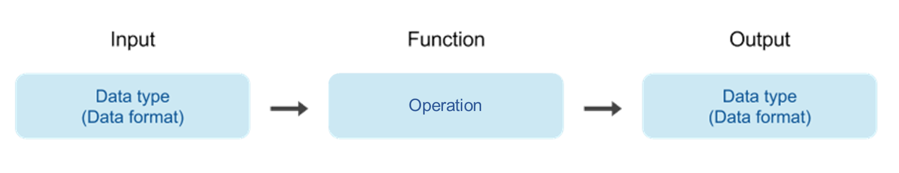
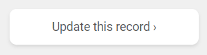
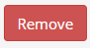

Quickstart guide
================

This guide aims to help you through the different steps to add entries to `bio.tools`_.

.. Note::
    If you find a bug, have any questions or suggestions, please `get in touch <mailto:registry-support@elixir-dk.org>`_.

Create an account
-----------------
Creating an account on *bio.tools* is very quick and simple. Just click on the `Sign-up` button
at the top-right corner of the page.
Then you just need to give a username, your email address and a password to get your account done. 

.. _`sign up`: https://bio.tools/signup

Add content
-----------
Everyone is welcome to add their own and other resources to *bio.tools*. Once your account is
created, you can start adding your content by clicking on `Menu ... Add content`.

The description of an new entry is handled by different tabs within the registration interface that are described below.

At any moment, you can check the validity of your information by clicking on Validate and
save it by clicking on Save |validate_save|.

.. Note::
    Saving the entry makes it directly available online.
    If you want to save what you have done without publishing it, the only
    way currently is to go to the :ref:`json` tab and save the .json file locally.

.. _`add content`: https://bio.tools/register

.. |validate_save| image:: _static/validate_save.png
   :width: 100px
   :height: 30px

.. Important::
    The minimum information required (name, desription and homepage URL) is marked with a red asterix |asterix| in the registration interface.

    It's recommended - especially if you have many tools to add - to read the `Curators Guide <https://biotools.readthedocs.io/en/latest/curators_guide.html>`_ first.
	    
Summary
"""""""
For this first part, you give the basic descriptors. This includess the **name** 
of your resource with a **description**, its **version** and a **homepage URL**. A unique **ID**
is automatically generated from the name.

  .. Note::
   A `unique identifier <https://biotools.readthedocs.io/en/latest/curators_guide.html#id105>`_ (*bio.tools* toolID) is a URL-safe version of the supplied resource name.  It's used in persitent URLs to *bio.tools* "Tool Cards", *e.g.* for the tool ID of "signalp":
    
     - http://bio.tools/tool/signalp
     - http://bio.tools/t/signalp
     - http://bio.tools/signalp

   Currently, if you want to change the ID you have to mail `Registry Support <mailto:registry-support@elixir-dk.org>`_.  In future, the ID will be editable at registration time. 

      
Function
""""""""
This is where you describe the functionality of the tool based on the `EDAM ontology`_ [1]_.
The functionality is captured in a diagram on the Tool Cards that look like this:

|biotool_function| 

In each box, you can add as many fields as you want. You can also add a general comment about the function (*this is particularly useful when your entry has several functions*).  It's highly recommended to read up about `tool functions <https://biotools.readthedocs.io/en/latest/curators_guide.html#toolfunctions>`_ before filling this section.

.. Note::
   It can be difficult to find the right terms to describe a tools operation(s), input(s) or output(s).  You can use `OLS EDAM`_, `BioPortal`_ and `EDAM Browser`_ to browse EDAM and find the terms you need, or request new terms via `GitHub <https://github.com/edamontology/edamontology/issues>`_.  Improvements (including term requests) to the term picker in *bio.tools* are planned.
    
.. _`EDAM ontology`: http://github.com/edamontology/edamontology/
.. _`OLS EDAM`: https://www.ebi.ac.uk/ols/ontologies/edam
.. _`BioPortal`: https://bioportal.bioontology.org/ontologies/EDAM/?p=classes&conceptid=root
.. _`EDAM Browser`: https://ifb-elixirfr.github.io/edam-browser/

Labels
""""""
In this part, you can tell more about your tool:

* What **type** of resource it is (Command-line tool, Web application *etc.*)
* Relevant **topic(s)** the tool fits with (from the `EDAM ontology`_ [1]_).
* In which **operating system** it is possible to use it.
* The **language** used to develop the tool, its **license** and **maturity**.
* The **accessibility** of your tool and its **cost**.

You can also assign your tool to an arbitrary **collection** which can be useful for grouping together related tools.

Links
"""""
It is the place where your add links that do not belong to Download or Documentation.  For instance, a link to a mailing list, mirror or repository (full list available on the drop-down menu of **Link type**).

Download
""""""""
You can here share all the different download links you want. It can be many different kind such as binaries, source code, biological data, test data *etc.* (see the **Download type** drop-down menu).

Documentation
"""""""""""""
Make your different documentations for your tool available here. Again, you can assign type of documentation using **Documentation type**.

Publications
""""""""""""
Share the different publications of the tool, which can be the primary publication (the one to cite when the tool is used), but also
reviews or secondary references (see **Publication type**). You can use either the **PubMed Central ID** (PMCID), the **PubMed ID** (PMID) or the **Digital Object ID** (DOI) - DOI is preferred.

.. _credits:

Credits & Support
"""""""""""""""""
Credits include all type of entities that contributed to the development, maintenance or provision of the resource. Credits can have an **Entity type** (Person, Institute *etc.*) and an **Entity role** (Developer, Documentor *etc.*).  Use the role of *Primary contact* to indicate preferred contact details.

.. _json:

JSON
""""
This is all the information you gave about your tool, formatted in JSON format.

Permissions
"""""""""""
You can decide to make the entry either editable only by yourself, a list of users or anyone.

Update a resource
-----------------
You'll see up to three different buttons at the bottom right of the Tool Card: |update|

* Click on *Update this record* to edit it
* Click on *Request editing rights* if you want to get edit rights to the entry 
* Click on *Request ownership* if you want to claim ownership of the entry

..Note::
  *bio.tools* entries are owned by the individuals who created them. Ownerships may grant edit rights, or transder ownership of their entries to others. 
  
  

Remove a resource
-----------------
From the tool card, click on update this record. Then you can remove the entry by clicking on the remove button |remove|.

.. warning::
    Removing an entry is definitive.  There's no way back (other than emailing `Registry Support <mailto:registry-support@elixir-dk.org>`_).

Search for a tool
-----------------
Coming soon...

References
----------
.. [1] Ison, J., Kalaš, M., Jonassen, I., Bolser, D., Uludag, M., McWilliam, H., Malone, J., Lopez, R., Pettifer, S. and Rice, P. (2013). EDAM: an ontology of bioinformatics operations, types of data and identifiers, topics and formats. Bioinformatics, 29(10): 1325-1332.

.. _`bio.tools`: https://bio.tools
